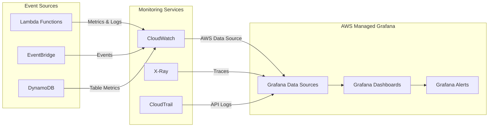
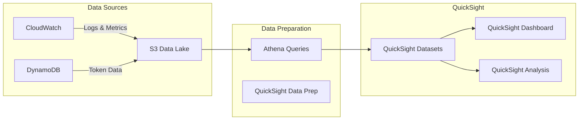
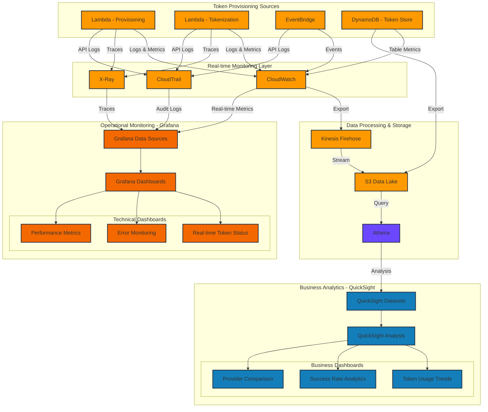

# Visualize flow and metrics


1. **Key Metrics Cards**
   * Total Requests: Overall volume of token requests
   * Success Rate: Percentage of successful tokenization
   * Average Processing Time: Mean time to provision tokens
   * Failure Rate: Percentage of failed requests
   * Active Tokens: Currently active tokens in circulation
2. **Provisioning Trends Chart**
   * Real-time line chart showing:
     * Successful tokenizations
     * Failed attempts
     * Pending requests
   * Time-series data with hourly breakdown
   * Interactive tooltips and legend
3. **Recent Token Requests**
   * Live feed of recent tokenization attempts
   * Color-coded status indicators
   * Device information
   * Reason for success/failure
   * Timestamp of request

To implement this in your environment:

1.  **Data Integration**

    ```typescript
    // Example of data structure needed
    interface TokenMetrics {
      totalRequests: number;
      successRate: number;
      averageTime: string;
      failureRate: number;
      activeTokens: number;
    }

    interface TokenRequest {
      id: string;
      status: 'SUCCESS' | 'PENDING' | 'FAILED';
      time: string;
      device: string;
      reason: string;
    }
    ```
2.  **CloudWatch Metrics to Track**:

    ```typescript
    const metricsToTrack = [
      'TokenProvisioningRequests',
      'TokenProvisioningSuccess',
      'TokenProvisioningFailure',
      'TokenProvisioningLatency',
      'ActiveTokenCount'
    ];
    ```
3. **Suggested CloudWatch Alarms**:
   * High failure rate (> 5%)
   * Abnormal latency (> 3s)
   * Sudden spike in requests
   * Unusual decline in success rate

Would you like me to:

1. Add any specific metrics for your use case?
2. Modify the visualization style?
3. Add additional monitoring parameters?
4. Include specific error handling patterns?


You can definitely achieve this using either AWS Managed Grafana or QuickSight without building a custom dashboard. Let me break down both approaches:

1. **AWS Managed Grafana Approach**:




Steps for AWS Grafana setup:

```yaml
# Example CloudWatch Metrics to track in Grafana
metrics:
  - namespace: "TokenProvisioning"
    dimensions:
      - WalletProvider: "ApplePay"
      - Issuer: "DEMO_Bank"
    metrics:
      - name: TokenProvisioningRequests
        statistic: Sum
        period: 60
      - name: SuccessRate
        statistic: Average
        period: 60
      - name: ProvisioningLatency
        statistic: Average
        period: 60
```

2. **Amazon QuickSight Approach**:




Key Differences and Recommendations:

1. **Use AWS Managed Grafana if**:
   * You need real-time monitoring (seconds/minutes granularity)
   * Technical teams are primary users
   * You want advanced alerting capabilities
   * You need distributed tracing visualization
   * Infrastructure metrics are important
2. **Use QuickSight if**:
   * Business users are primary audience
   * You need ML-powered insights
   * Batch analysis is sufficient (minutes/hours granularity)
   * You want to combine multiple data sources easily
   * Cost is a major factor (usually cheaper than Grafana)

Example QuickSight Analysis:

```sql
-- Example Athena query for QuickSight dataset
SELECT 
    wallet_provider,
    issuer,
    timestamp,
    status,
    COUNT(*) as request_count,
    AVG(CASE WHEN status = 'SUCCESS' THEN 1 ELSE 0 END) * 100 as success_rate,
    AVG(processing_time) as avg_processing_time
FROM token_provisioning_logs
WHERE date >= DATE_SUB(CURRENT_DATE, 30)
GROUP BY 1,2,3,4
ORDER BY timestamp DESC
```

Recommended Setup:

1. **For Real-time Operational Monitoring (Grafana)**:
   * Set up AWS Managed Grafana
   * Configure CloudWatch data source
   * Create dashboards for:
     * Real-time token provisioning status
     * Error rates and types
     * Processing latency
     * Geographic distribution
2. **For Business Analytics (QuickSight)**:
   * Set up data pipeline to S3
   * Create Athena views
   * Build QuickSight dashboards for:
     * Token usage patterns
     * Success rate trends
     * Provider comparison
     * Issue analysis
3. **Hybrid Approach**:
   * Use Grafana for technical monitoring
   * Use QuickSight for business reporting
   * Share data between both platforms via S3

## Hybrid

I'll create a comprehensive diagram showing how both Grafana and QuickSight can be used together in a hybrid monitoring approach for token provisioning.




This hybrid architecture provides:

1. **Real-time Operational Monitoring (Grafana)**:
   * Technical Dashboards:
     * Real-time token status monitoring
     * Error tracking and alerting
     * Performance metrics and SLA monitoring
   * Data Sources:
     * Direct CloudWatch metrics
     * X-Ray traces
     * CloudTrail logs
2. **Business Intelligence (QuickSight)**:
   * Business Dashboards:
     * Token usage trends and patterns
     * Success rate analytics
     * Provider comparison and insights
   * Data Sources:
     * Aggregated data in S3
     * Historical analysis via Athena
3. **Data Flow**:
   * Real-time events flow to CloudWatch
   * Kinesis Firehose streams data to S3
   * DynamoDB exports provide token status history
   * Athena queries prepare data for QuickSight
4. **Monitoring Responsibilities**:

```yaml
Grafana:
  - Real-time monitoring:
    - Token provisioning status
    - Error rates and alerts
    - Performance metrics
    - SLA compliance
  Users: 
    - DevOps teams
    - Support engineers
    - System operators

QuickSight:
  - Business analytics:
    - Usage patterns
    - Success rates
    - Provider performance
    - Trend analysis
  Users:
    - Business analysts
    - Product managers
    - Executive team
```

5. **Integration Points**:
   * Common data lake in S3
   * Shared metrics from CloudWatch
   * Complementary alerting systems
   * Cross-referenced dashboards

## Examples

I'll provide examples of data structures and configurations for X-Ray traces, CloudTrail logs, and CloudWatch metrics specifically for token provisioning monitoring.

```json
// X-Ray Trace Example
{
  "Id": "1-5f2aef12-6b4f7a9c8d2e1f3a2b1c0d9",
  "Duration": 1.654,
  "Segments": [
    {
      "Id": "8b395769abc", 
      "Name": "TokenProvisioningService",
      "StartTime": 1696419812.925,
      "EndTime": 1696419814.579,
      "Http": {
        "Request": {
          "Method": "POST",
          "URL": "/api/v1/tokens/provision",
          "UserAgent": "ApplePay/iOS/16.0",
          "ClientIp": "192.168.1.1"
        },
        "Response": {
          "Status": 200,
          "ContentLength": 845
        }
      },
      "Annotations": {
        "WalletProvider": "ApplePay",
        "Issuer": "DEMO_Bank",
        "CardBin": "424242"
      },
      "Subsegments": [
        {
          "Name": "DynamoDB",
          "StartTime": 1696419813.125,
          "EndTime": 1696419813.385,
          "Namespace": "aws.dynamodb",
          "SQL": {
            "Query": "GetItem on TokenStore table"
          }
        },
        {
          "Name": "TokenizationService",
          "StartTime": 1696419813.486,
          "EndTime": 1696419814.125,
          "Metadata": {
            "TokenType": "DPAN",
            "TokenRequestor": "ApplePay"
          }
        }
      ]
    }
  ]
}

// CloudTrail Log Event Example
{
  "eventVersion": "1.08",
  "eventTime": "2024-01-15T10:25:12Z",
  "eventSource": "tokenization.amazonaws.com",
  "eventName": "ProvisionToken",
  "awsRegion": "us-east-1",
  "sourceIPAddress": "54.239.123.45",
  "userAgent": "TokenProvisioningService/1.0",
  "requestParameters": {
    "walletProvider": "ApplePay",
    "issuerName": "DEMO_Bank",
    "cardholderData": {
      "bin": "424242",
      "tokenRequestorId": "50123456"
    }
  },
  "responseElements": {
    "tokenProvisioningStatus": "SUCCESS",
    "tokenReferenceId": "trm_abc123xyz",
    "processingTime": 1.245
  },
  "requestID": "a1b2c3d4-5678-90ab-cdef-EXAMPLE12345",
  "eventType": "AwsApiCall",
  "recipientAccountId": "123456789012"
}

// CloudWatch Metrics Configuration
{
  "Metrics": [
    {
      "MetricName": "TokenProvisioningRequests",
      "Namespace": "TokenServices",
      "Dimensions": [
        {
          "Name": "WalletProvider",
          "Value": "ApplePay"
        },
        {
          "Name": "Issuer",
          "Value": "DEMO_Bank"
        }
      ],
      "Unit": "Count",
      "Value": 1.0
    },
    {
      "MetricName": "TokenProvisioningLatency",
      "Namespace": "TokenServices",
      "Dimensions": [
        {
          "Name": "WalletProvider",
          "Value": "ApplePay"
        },
        {
          "Name": "Issuer",
          "Value": "DEMO_Bank"
        }
      ],
      "Unit": "Seconds",
      "Value": 1.245
    }
  ],
  "CloudWatch Logs": {
    "logGroup": "/aws/lambda/token-provisioning-service",
    "logStream": "2024/01/15/[$LATEST]abc123",
    "events": [
      {
        "timestamp": 1705312512000,
        "message": {
          "level": "INFO",
          "requestId": "a1b2c3d4-5678-90ab-cdef-EXAMPLE12345",
          "event": "TOKEN_PROVISION_START",
          "walletProvider": "ApplePay",
          "issuer": "DEMO_Bank",
          "correlationId": "corr_xyz789"
        }
      },
      {
        "timestamp": 1705312513245,
        "message": {
          "level": "INFO",
          "requestId": "a1b2c3d4-5678-90ab-cdef-EXAMPLE12345",
          "event": "TOKEN_PROVISION_SUCCESS",
          "tokenReferenceId": "trm_abc123xyz",
          "processingTime": 1.245,
          "correlationId": "corr_xyz789"
        }
      }
    ]
  }
}

```

Now, let me show you how to set up CloudWatch Metric Filters and Alarms:

```yaml
# CloudWatch Metric Filters
MetricFilters:
  ProvisioningSuccess:
    FilterPattern: '[timestamp, requestId, event="TOKEN_PROVISION_SUCCESS", ...]'
    MetricNamespace: "TokenServices"
    MetricName: "SuccessfulTokenProvisioning"
    MetricValue: "1"

  ProvisioningFailure:
    FilterPattern: '[timestamp, requestId, event="TOKEN_PROVISION_FAILURE", ...]'
    MetricNamespace: "TokenServices"
    MetricName: "FailedTokenProvisioning"
    MetricValue: "1"

  ProvisioningLatency:
    FilterPattern: '[timestamp, requestId, event="TOKEN_PROVISION_SUCCESS", processingTime]'
    MetricNamespace: "TokenServices"
    MetricName: "TokenProvisioningLatency"
    MetricValue: "$processingTime"

# CloudWatch Alarms
Alarms:
  HighFailureRate:
    MetricName: "FailedTokenProvisioning"
    Namespace: "TokenServices"
    Period: 300
    EvaluationPeriods: 2
    Threshold: 5
    ComparisonOperator: "GreaterThanThreshold"
    AlarmActions: 
      - "arn:aws:sns:region:account-id:token-alerts"

  HighLatency:
    MetricName: "TokenProvisioningLatency"
    Namespace: "TokenServices"
    Period: 300
    EvaluationPeriods: 3
    Threshold: 3
    ComparisonOperator: "GreaterThanThreshold"
    AlarmActions:
      - "arn:aws:sns:region:account-id:token-alerts"

# Grafana Dashboard Query Examples
GrafanaDashboardQueries:
  SuccessRate:
    query: |
      SELECT 
        SUM(SuccessfulTokenProvisioning) / 
        (SUM(SuccessfulTokenProvisioning) + SUM(FailedTokenProvisioning)) * 100 
      FROM TokenServices 
      GROUP BY WalletProvider, Issuer, TIME

  Latency:
    query: |
      SELECT 
        AVG(TokenProvisioningLatency) 
      FROM TokenServices 
      GROUP BY WalletProvider, Issuer, TIME

# QuickSight Analysis Query
QuickSightQuery:
  DailyMetrics:
    query: |
      SELECT 
        date_trunc('day', timestamp) as date,
        wallet_provider,
        issuer,
        COUNT(*) as total_requests,
        SUM(CASE WHEN event = 'TOKEN_PROVISION_SUCCESS' THEN 1 ELSE 0 END) as successful_requests,
        AVG(CASE WHEN event = 'TOKEN_PROVISION_SUCCESS' THEN processing_time END) as avg_latency
      FROM token_provisioning_logs
      WHERE timestamp >= date_add('day', -30, current_date)
      GROUP BY 1, 2, 3
      ORDER BY 1 DESC

```

Key points about the monitoring data:

1. **X-Ray Traces**:
   * Captures entire token provisioning flow
   * Shows timing for each component
   * Includes HTTP request/response details
   * Records annotations for filtering
   * Tracks subsegments for dependent services
2. **CloudTrail Logs**:
   * Records API calls
   * Captures request parameters
   * Includes response elements
   * Provides audit trail
   * Helps with compliance
3. **CloudWatch**:
   * Metrics:
     * Request counts
     * Latency measurements
     * Success/failure rates
     * Custom dimensions
   * Logs:
     * Structured log events
     * Correlation IDs
     * Timing information
     * Business events
4. **Integration Tips**:
   * Use correlation IDs across all systems
   * Consistent dimension naming
   * Standard event naming
   * Common timestamp format

Would you like me to:

1. Show how to query this data in Grafana/QuickSight?
2. Provide more alarm configurations?
3. Add more specific metrics or logs?
4. Explain the metric filter patterns in detail?
