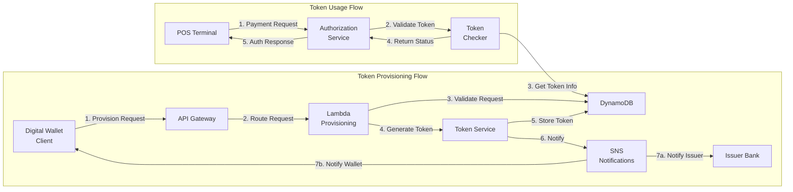
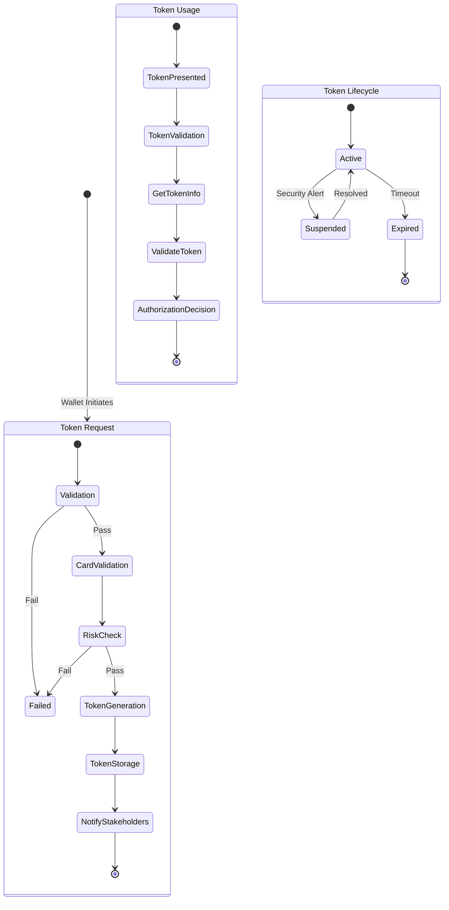

# Visualize how services are linked together for each business flow

Yes! There are several ways to visualize service connections and business flows. Let me show you using AWS X-Ray Service Map and a custom Mermaid diagram for business flow visualization.




For more detailed business flow visualization:




And here's how to track these flows in AWS X-Ray:

```javascript
// Lambda Instrumentation for Token Provisioning
const AWSXRay = require('aws-xray-sdk');
const AWS = AWSXRay.captureAWS(require('aws-sdk'));

exports.handler = async (event) => {
    // Create custom subsegment for business flow
    const segment = AWSXRay.getSegment();
    const subsegment = segment.addNewSubsegment('TokenProvisioningFlow');
    
    try {
        // Add business context
        subsegment.addAnnotation('WalletProvider', event.walletProvider);
        subsegment.addAnnotation('Issuer', event.issuer);
        subsegment.addAnnotation('FlowType', 'TokenProvisioning');
        
        // Add business metrics
        subsegment.addMetadata('requestContext', {
            correlationId: event.correlationId,
            requestTime: new Date().toISOString(),
            cardProductType: event.cardProduct
        });
        
        // Track flow steps
        const validationSubsegment = subsegment.addNewSubsegment('RequestValidation');
        // Validation logic
        validationSubsegment.close();
        
        const tokenizationSubsegment = subsegment.addNewSubsegment('TokenGeneration');
        // Token generation logic
        tokenizationSubsegment.close();
        
        const storageSubsegment = subsegment.addNewSubsegment('TokenStorage');
        // Storage logic
        storageSubsegment.close();
        
    } catch (error) {
        subsegment.addError(error);
        throw error;
    } finally {
        subsegment.close();
    }
};

// CloudWatch Metrics for Flow Tracking
const cloudwatch = new AWS.CloudWatch();

async function trackFlowMetrics(flowStep, status, duration) {
    await cloudwatch.putMetricData({
        Namespace: 'TokenServices/BusinessFlow',
        MetricData: [
            {
                MetricName: 'FlowStepDuration',
                Dimensions: [
                    { Name: 'FlowStep', Value: flowStep },
                    { Name: 'Status', Value: status }
                ],
                Value: duration,
                Unit: 'Milliseconds'
            }
        ]
    }).promise();
}

```

To visualize these flows in Grafana or QuickSight:

1. **Grafana Service Map Panel**:
   * Shows real-time service connections
   * Indicates request volume through line thickness
   * Colors indicate service health
   * Shows latency between services
2. **QuickSight Business Flow Analysis**:
   * Success rates per flow step
   * Time spent in each stage
   * Failure points analysis
   * Volume trends
3. **Monitoring Setup**:

```yaml
Metrics to Track:
  - Flow step duration
  - Success rate per step
  - Error rate per step
  - Service dependencies
  - Business outcomes

Dimensions:
  - WalletProvider
  - Issuer
  - FlowType
  - StepName
  - Status
```

Would you like me to:

1. Add more detail to specific flow steps?
2. Show how to set up specific monitoring for each step?
3. Create dashboard examples for flow visualization?
4. Add error handling and recovery flows?
