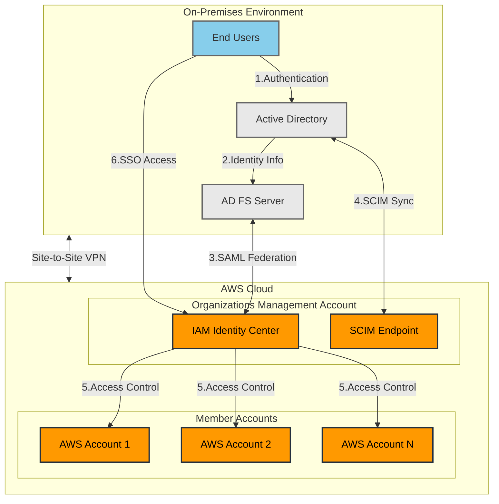

# AWS IAM Identity Center Integration with Active Directory

### Overview

This document provides technical guidance for implementing AWS IAM Identity Center (formerly AWS Single Sign-On) integration with on-premises Active Directory using SAML 2.0 federation and SCIM for user provisioning.

### Prerequisites

* Active AWS Organizations implementation
* Existing on-premises Active Directory
* Configured AWS Site-to-Site VPN connection
* Administrative access to both AWS Organizations management account and Active Directory
* SSL certificate for secure SAML communication

### Architecture Components

1. AWS IAM Identity Center
2. On-premises Active Directory
3. SAML 2.0 federation
4. SCIM v2.0 protocol
5. Attribute-based access controls (ABAC)
6. AWS Organizations

### Implementation Steps

#### 1. Prepare Active Directory Environment

1.1. Install and configure Active Directory Federation Services (AD FS)

* Install AD FS role on Windows Server
* Configure service account with appropriate permissions
* Install and configure required SSL certificates

1.2. Set up required Active Directory groups

* Create security groups for different access levels
* Ensure group naming convention aligns with planned ABAC strategy

#### 2. Configure AWS IAM Identity Center

2.1. Enable IAM Identity Center

* Navigate to IAM Identity Center console
* Enable service in Organizations management account
* Select region for IAM Identity Center

2.2. Configure Identity Source

* Choose "External identity provider"
* Select SAML 2.0 federation
* Download AWS service provider metadata file

#### 3. Configure SAML Federation

3.1. Set up AD FS Relying Party Trust

* Import AWS service provider metadata
* Configure claim rules for:
  * NameID
  * Groups
  * Email
  * Given name
  * Family name
  * Department

3.2. Export AD FS Metadata

* Download federation metadata XML file
* Import into IAM Identity Center

#### 4. Implement SCIM Provisioning

4.1. Configure SCIM Endpoint

* Enable automatic provisioning in IAM Identity Center
* Generate SCIM endpoint URL and access token
* Configure SCIM client in AD FS

4.2. Set up User and Group Synchronization

* Configure filtering rules for user sync
* Set up group mapping
* Test synchronization process

#### 5. Configure Access Control

5.1. Define ABAC Strategy

* Create attribute-based access control policies
* Map AD groups to AWS permissions
* Configure permission sets for different access levels

5.2. Set up Permission Sets

* Create permission sets for common job functions
* Configure AWS managed policies
* Set up custom permission policies as needed

5.3. Configure AWS Account Access

* Assign permission sets to groups
* Configure account access assignments
* Set up multi-account access

### Security Considerations

* Implement least privilege access
* Enable MFA for all users
* Regular review of access patterns
* Audit logging and monitoring
* Password policy enforcement
* Network security controls

### Monitoring and Maintenance

#### Monitoring

* Configure CloudWatch metrics
* Set up alerting for failed authentications
* Monitor SCIM synchronization status
* Track access patterns

#### Regular Maintenance Tasks

* Review and update permission sets
* Audit group memberships
* Update SSL certificates
* Patch AD FS servers
* Review security policies

### Troubleshooting

#### Common Issues

1. SAML authentication failures
   * Check certificate expiration
   * Verify claim rules
   * Validate metadata configuration
2. SCIM synchronization issues
   * Verify network connectivity
   * Check SCIM token validity
   * Review synchronization logs
3. Access permission issues
   * Validate group memberships
   * Check permission set assignments
   * Verify ABAC policy conditions

### Backup and Disaster Recovery

* Regular backup of AD FS configuration
* Documentation of all settings
* Backup of SSL certificates
* DR plan for identity provider failure
* Alternate access methods for emergencies

### Best Practices

1. Implement change management procedures
2. Regular security reviews
3. Documentation maintenance
4. User training
5. Regular testing of DR procedures
6. Periodic access reviews
7. Configuration version control

### Support and Escalation

* Define support processes
* Document escalation procedures
* Maintain contact information
* Set up incident response plan

### Compliance and Auditing

* Enable AWS CloudTrail
* Configure audit logging
* Regular compliance reviews
* Documentation of controls
* Access review procedures

This implementation provides a secure, scalable, and maintainable solution for AWS account access management using existing Active Directory infrastructure while maintaining security best practices and enabling proper governance.
