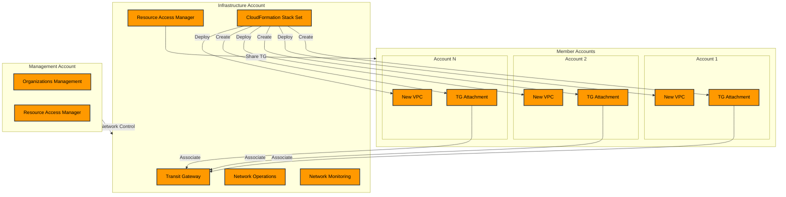

# AWS Multi-Account Network Architecture with Infrastructure Account

### Overview

This document outlines the design and implementation of a multi-account AWS network architecture using a dedicated Infrastructure Account for centralized network management. The solution leverages AWS Transit Gateway for inter-VPC connectivity and automates VPC creation across member accounts using CloudFormation Stack Sets.

### Architecture Components

#### Account Structure

1. Management Account
   * Primary purpose: AWS Organizations management
   * Responsibilities:
     * Organization-wide governance
     * Account management
     * Service control policies (SCPs)
     * Billing and cost management
2. Infrastructure Account
   * Primary purpose: Centralized network management
   * Responsibilities:
     * Transit Gateway management
     * Network resource deployment automation
     * Network monitoring and operations
     * Network security controls
3. Member Accounts
   * Purpose: Workload hosting
   * Contain: Application-specific VPCs
   * Connect: Via Transit Gateway attachments




### Implementation Guide

#### Phase 1: Account Setup

1. Infrastructure Account Creation

```bash
# Create dedicated Infrastructure Account through Organizations
aws organizations create-account \
    --email network-infra@company.com \
    --account-name "Network Infrastructure"
```

2. Required IAM Roles

```yaml
# infrastructure-account-roles.yaml
Resources:
  NetworkAdminRole:
    Type: AWS::IAM::Role
    Properties:
      AssumeRolePolicyDocument:
        Version: '2012-10-17'
        Statement:
          - Effect: Allow
            Principal:
              Service: cloudformation.amazonaws.com
            Action: sts:AssumeRole
      ManagedPolicyArns:
        - arn:aws:iam::aws:policy/AWSNetworkAdministrator
```

#### Phase 2: Transit Gateway Setup

1. Create Transit Gateway

```yaml
# transit-gateway.yaml
Resources:
  CentralTransitGateway:
    Type: AWS::EC2::TransitGateway
    Properties:
      AmazonSideAsn: 64512
      AutoAcceptSharedAttachments: enable
      DefaultRouteTableAssociation: enable
      DefaultRouteTablePropagation: enable
      Description: Central Transit Gateway for Organization
      Tags:
        - Key: Environment
          Value: Production
```

2. Configure Resource Sharing

```yaml
# resource-sharing.yaml
Resources:
  TransitGatewayShare:
    Type: AWS::RAM::ResourceShare
    Properties:
      Name: OrganizationTransitGatewayShare
      Principals: 
        - '*'
      ResourceArns:
        - !Ref CentralTransitGateway
```

#### Phase 3: Stack Set Configuration

1. Stack Set IAM Roles

```yaml
# stackset-roles.yaml
Resources:
  StackSetAdminRole:
    Type: AWS::IAM::Role
    Properties:
      AssumeRolePolicyDocument:
        Version: '2012-10-17'
        Statement:
          - Effect: Allow
            Principal:
              Service: cloudformation.amazonaws.com
            Action: sts:AssumeRole
      ManagedPolicyArns:
        - arn:aws:iam::aws:policy/AdministratorAccess
```

2. VPC Template

```yaml
# member-vpc-template.yaml
Parameters:
  TransitGatewayId:
    Type: String
    Description: ID of the shared Transit Gateway

Resources:
  MemberVPC:
    Type: AWS::EC2::VPC
    Properties:
      CidrBlock: !Sub 10.${AWS::AccountId}.0.0/16
      EnableDnsSupport: true
      EnableDnsHostnames: true
      Tags:
        - Key: Purpose
          Value: Workload

  TransitGatewayAttachment:
    Type: AWS::EC2::TransitGatewayAttachment
    Properties:
      TransitGatewayId: !Ref TransitGatewayId
      VpcId: !Ref MemberVPC
      SubnetIds: !Ref PrivateSubnets
```

#### Phase 4: Automation Implementation

1. Stack Set Deployment

```bash
# Deploy from Infrastructure Account
aws cloudformation create-stack-set \
    --stack-set-name member-vpc-deployment \
    --template-body file://member-vpc-template.yaml \
    --capabilities CAPABILITY_NAMED_IAM \
    --permission-model SERVICE_MANAGED
```

2. Stack Instance Creation

```bash
aws cloudformation create-stack-instances \
    --stack-set-name member-vpc-deployment \
    --regions us-east-1 \
    --deployment-targets OrganizationalUnitIds='["ou-xxxx-xxxxxxxx"]'
```

### Network Operations

#### Monitoring Setup

1. VPC Flow Logs Configuration
2. Transit Gateway Network Manager
3. CloudWatch Metrics and Alarms

#### Security Controls

1. Network Access Controls
   * Security Groups
   * NACLs
   * Route Table management
2. Compliance Requirements
   * Traffic monitoring
   * Security assessments
   * Compliance reporting

#### Operational Procedures

1. New Account Onboarding
2. Route Management
3. Troubleshooting Process

### Best Practices

#### Architecture Principles

1. Centralization
   * Single point of network control
   * Consistent policy enforcement
   * Unified monitoring
2. Automation
   * Infrastructure as Code
   * Automated deployments
   * Version control
3. Security
   * Least privilege access
   * Network segmentation
   * Continuous monitoring

#### Cost Management

1. Transit Gateway pricing considerations
2. VPC networking costs
3. Cross-AZ traffic optimization

### Troubleshooting Guide

#### Common Issues

1. Stack Set Deployment Failures
   * Permission issues
   * Network constraints
   * Resource limits
2. Connectivity Problems
   * Route table configuration
   * Security group rules
   * Transit Gateway attachments

#### Resolution Steps

1. Verification Procedures
2. Logging Analysis
3. Escalation Process

### Maintenance and Updates

#### Regular Tasks

1. Route table audits
2. Security group reviews
3. Compliance checking

#### Change Management

1. Network changes
2. Stack Set updates
3. Security patches

### Appendix

#### Reference Architecture

\[Include the architecture diagram]

#### Useful Commands

```bash
# Check Transit Gateway status
aws ec2 describe-transit-gateways

# List Stack Set operations
aws cloudformation list-stack-set-operations

# Verify route propagation
aws ec2 describe-transit-gateway-route-tables
```

#### Documentation Links

1. AWS Transit Gateway
2. AWS Organizations
3. CloudFormation Stack Sets

### Version History

| Version | Date       | Author       | Changes          |
| ------- | ---------- | ------------ | ---------------- |
| 1.0     | 2025-01-11 | Network Team | Initial document |

***

End of Document
