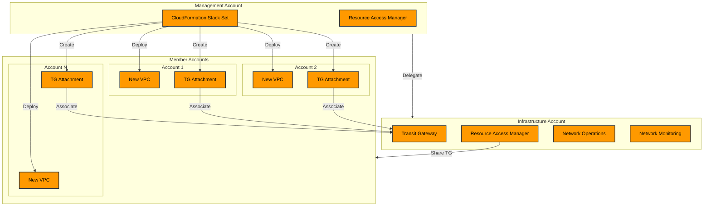

# Better Option

Using a dedicated Infrastructure Account would be better because:

1. Separation of Concerns:
   * Management account focuses on organizational governance and control
   * Infrastructure account specializes in network management and operations
   * Reduces risk by limiting access to the management account
2. Better Security:
   * Network administrators don't need access to the management account
   * More granular IAM permissions for networking resources
   * Easier to audit network-related activities
3. Centralized Network Management:
   * Single place for all shared networking resources
   * Dedicated monitoring and logging for network operations
   * Consistent network policies and configurations
4. Cost Management:
   * Clear visibility of networking costs
   * Easier to allocate network expenses
   * Separate billing for shared network resources
5. Operational Benefits:
   * Dedicated network operations team access
   * Simplified troubleshooting
   * Centralized network monitoring and alerting

The revised architecture would involve:

1. Creating Transit Gateway in the Infrastructure Account
2. Using RAM from the Infrastructure Account to share the Transit Gateway
3. Still deploying Stack Sets from the Management Account
4. Centralizing network monitoring and operations in the Infrastructure Account

This is more aligned with AWS Well-Architected Framework and enterprise best practices for AWS Organizations design. Would you like me to update the implementation
