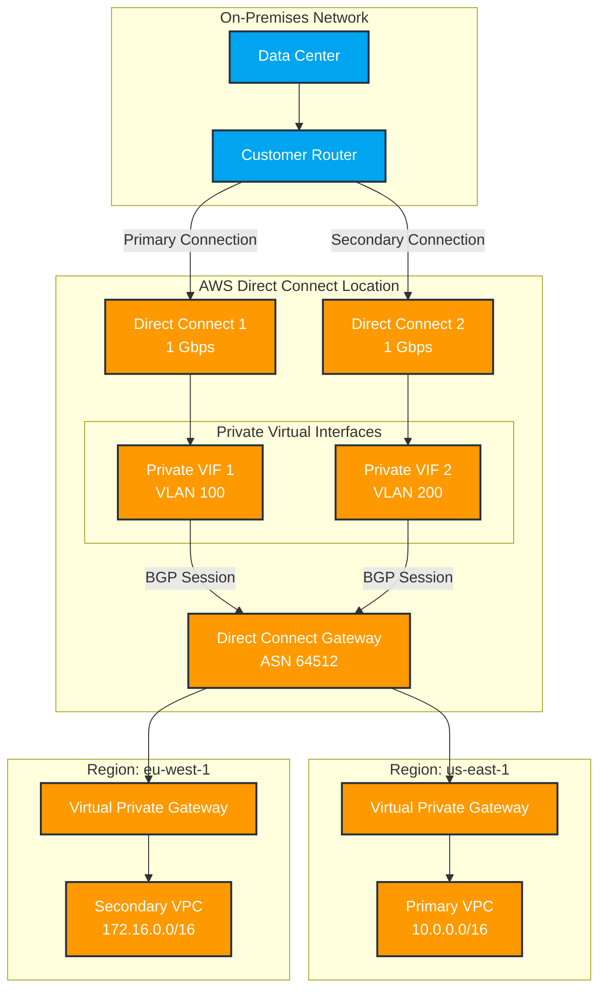

# Direct Connect Gateway Implementation Guide

### Overview

This document outlines the step-by-step process for implementing a redundant AWS Direct Connect setup using Direct Connect Gateway to enable multi-region connectivity. The implementation will migrate from a single 1 Gbps connection to a redundant setup while maintaining service availability.

### Current Architecture

* Single 1 Gbps AWS Direct Connect connection
* Single private virtual interface
* Single VPC connectivity
* No cross-region capabilities

### Target Architecture

* Dual 1 Gbps AWS Direct Connect connections
* Direct Connect Gateway for multi-region support
* Redundant private virtual interfaces
* Capability to connect VPCs across multiple regions

### Prerequisites

1. AWS Direct Connect console access
2. Network admin access to on-premises router
3. BGP ASN for the Direct Connect Gateway
4. VLAN IDs for new virtual interfaces
5. IP address ranges for BGP peering
6. Maintenance window for migration

### Implementation Steps

#### Phase 1: Preparation

1. Document existing Direct Connect configuration:
   * Current private virtual interface settings
   * BGP configurations
   * Route tables
   * VLAN IDs
   * IP addressing
2. Order second Direct Connect connection:
   * Same speed (1 Gbps)
   * Same location as existing connection
   * Confirm LOA-CFA received
3. Configure on-premises router:
   * Additional physical port for new connection
   * BGP capability verification
   * Routing policy review

#### Phase 2: Direct Connect Gateway Setup

1.  Create Direct Connect Gateway:

    ```bash
    aws directconnect create-direct-connect-gateway \
      --direct-connect-gateway-name "Global-DXGW" \
      --amazon-side-asn "64512"
    ```
2.  Create VPC association:

    ```bash
    aws directconnect create-direct-connect-gateway-association \
      --direct-connect-gateway-id "dxgw-xxxxxx" \
      --virtual-gateway-id "vgw-xxxxxx"
    ```

#### Phase 3: Migration

1. Delete existing private virtual interface
   * Document all settings before deletion
   * Schedule during maintenance window
   * Verify backup connectivity (if available)
2. Create new private virtual interfaces:
   * Configure first VIF on existing DX
   * Configure second VIF on new DX
   * Assign unique VLAN IDs
   * Configure BGP settings
3.  Associate VIFs with Direct Connect Gateway:

    ```bash
    aws directconnect create-private-virtual-interface \
      --connection-id "dxcon-xxxxxx" \
      --direct-connect-gateway-id "dxgw-xxxxxx" \
      --virtual-interface-name "Primary-VIF" \
      --vlan 100 \
      --asn 65001
    ```

#### Phase 4: Testing and Validation

1. BGP Connection Testing:
   * Verify BGP sessions established
   * Check route propagation
   * Validate prefix advertisements
2. Connectivity Testing:
   * Test connectivity to VPC resources
   * Verify failover capabilities
   * Test latency and throughput
3. Monitoring Setup:
   * Configure CloudWatch metrics
   * Set up connection alerts
   * Enable VIF monitoring

#### Phase 5: Multi-Region Extension

1.  Associate additional VPCs:

    ```bash
    aws directconnect create-direct-connect-gateway-association \
      --direct-connect-gateway-id "dxgw-xxxxxx" \
      --virtual-gateway-id "vgw-yyyyyy" \
      --gateway-region "eu-west-1"
    ```
2. Configure route tables in each region
3. Test cross-region connectivity

### Network Architecture Diagram



