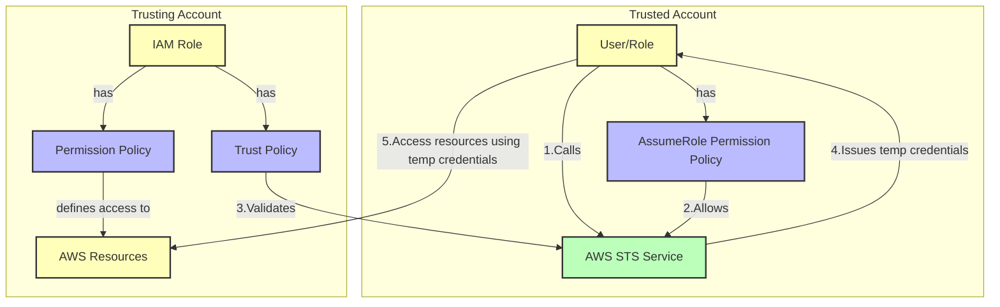

# Understanding Cross-Account IAM Roles in AWS

## Understanding Cross-Account IAM Roles in AWS




### Overview

A cross-account IAM role is a mechanism in AWS that enables you to grant access to resources in one AWS account (the trusting account) to users or services in another AWS account (the trusted account). This is a fundamental building block for implementing the principle of least privilege in multi-account AWS environments.

### Core Components

#### Trust Policy (in Trusting Account)

The trust policy is a JSON document attached to the role that defines which entities (AWS accounts, services, or users) can assume the role. For example:

```json
{
    "Version": "2012-10-17",
    "Statement": [{
        "Effect": "Allow",
        "Principal": {
            "AWS": "arn:aws:iam::TRUSTED-ACCOUNT-ID:root"
        },
        "Action": "sts:AssumeRole",
        "Condition": {}
    }]
}
```

#### Permission Policy (in Trusting Account)

The permission policy defines what actions the role can perform on which resources. This policy determines the actual permissions granted to users who successfully assume the role:

```json
{
    "Version": "2012-10-17",
    "Statement": [{
        "Effect": "Allow",
        "Action": [
            "s3:GetObject",
            "s3:ListBucket"
        ],
        "Resource": [
            "arn:aws:s3:::example-bucket",
            "arn:aws:s3:::example-bucket/*"
        ]
    }]
}
```

#### AssumeRole Permission Policy (in Trusted Account)

Users or roles in the trusted account need a permission policy allowing them to assume the cross-account role. This policy must be attached to the IAM users/roles that need to assume the cross-account role:

```json
{
    "Version": "2012-10-17",
    "Statement": [{
        "Effect": "Allow",
        "Action": "sts:AssumeRole",
        "Resource": "arn:aws:iam::TRUSTING-ACCOUNT-ID:role/CrossAccountRole"
    }]
}
```

### How It Works

1. Initial Setup
   * Trusting account creates an IAM role with trust and permission policies
   * Trusted account attaches AssumeRole permissions to relevant users/roles
   * No additional roles need to be created in the trusted account
2. Role Assumption
   * Users/services in the trusted account use AWS Security Token Service (STS)
   * STS verifies both the trust relationship and the user's permission to assume roles
   * If valid, STS returns temporary security credentials
3. Resource Access
   * The temporary credentials allow access to resources as defined in the permission policy
   * These credentials automatically expire after their defined duration (15 minutes to 12 hours)

### Common Use Cases

1. Central Security Management
   * A security team in one account manages security tools across multiple accounts
   * Enables centralized logging, monitoring, and compliance oversight
2. Application Development
   * Developers access resources across development, staging, and production accounts
   * Maintains separation of concerns while enabling necessary access
3. Managed Services
   * Third-party services require access to resources in your AWS account
   * Provides controlled, time-limited access without sharing long-term credentials

### Security Best Practices

1. External ID Usage
   * Implement external IDs in trust policies to prevent confused deputy problems
   * Especially important when granting access to third parties
2. Permission Boundaries
   * Set clear permission boundaries to limit maximum possible permissions
   * Use AWS Organizations Service Control Policies (SCPs) for additional controls
3. Access Monitoring
   * Enable AWS CloudTrail to log all role assumptions
   * Monitor and alert on unusual patterns of role usage
   * Regularly review and audit role permissions

### Implementation Example

Here's a complete setup using AWS CLI:

```bash
# In the trusting account: Create the role
aws iam create-role \
    --role-name CrossAccountRole \
    --assume-role-policy-document file://trust-policy.json

# In the trusting account: Attach permissions to the role
aws iam attach-role-policy \
    --role-name CrossAccountRole \
    --policy-arn arn:aws:iam::aws:policy/AmazonS3ReadOnlyAccess

# In the trusted account: Attach AssumeRole permission to user
aws iam put-user-policy \
    --user-name Developer \
    --policy-name CrossAccountAssume \
    --policy-document file://assume-role-policy.json

# In the trusted account: Assume the role
aws sts assume-role \
    --role-arn arn:aws:iam::TRUSTING-ACCOUNT-ID:role/CrossAccountRole \
    --role-session-name MySession
```

### Troubleshooting

Common issues and solutions:

1. Access Denied Errors
   * Verify trust policy correctly lists trusted account
   * Ensure permission policies grant necessary actions
   * Check if user/role in trusted account has sts:AssumeRole permission
   * Check for conflicting permission boundaries or SCPs
2. Unable to Assume Role
   * Confirm IAM user/role has explicit permission to assume the role
   * Verify external ID if required
   * Check for correct role ARN usage
   * Ensure trust policy and assume role permission policy ARNs match exactly
3. Unexpected Access Levels
   * Review effective permissions using IAM Access Analyzer
   * Check for inherited permissions from group memberships
   * Evaluate any resource-based policies

Cross-account IAM roles are a powerful feature that enables secure resource sharing across AWS accounts while maintaining strong security controls and audit capabilities. The setup requires configuration in both accounts: the role and its policies in the trusting account, and the necessary assume role permissions in the trusted account. By following the best practices and implementation guidelines outlined above, you can effectively use cross-account roles in your AWS environment.
