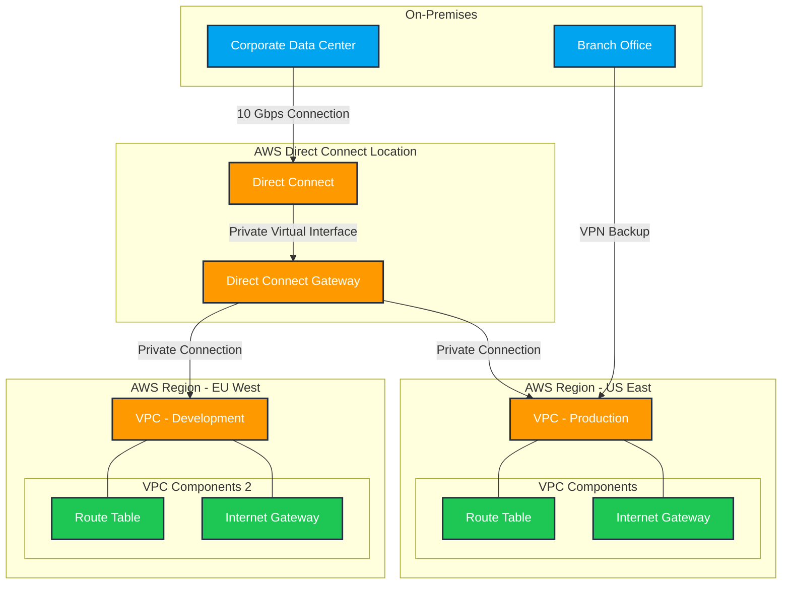
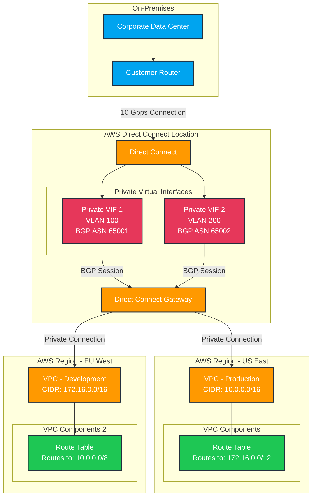

# Transit VS Direct Connect Gateway

The key difference is that Direct Connect Gateway is specifically for extending Direct Connect connections to multiple VPCs, while Transit Gateway is a more general-purpose hub for connecting multiple networks (VPCs, VPNs, Direct Connect) together with more complex routing capabilities.

Use a Custom/Transit Gateway when:

* You need to connect multiple VPCs with complex routing requirements
* You want hub-and-spoke network architecture
* You need to connect VPCs across different AWS accounts
* You require more granular routing control through route tables
* You want to connect VPCs to multiple on-premises networks
* You need support for multicast routing
* You want centralized network management and control
* You have many network connections to manage (it can handle thousands of connections)

Use a Direct Connect Gateway when:

* You specifically need to connect your on-premises network to multiple VPCs through AWS Direct Connect
* Your VPCs are in different regions but need to connect to the same on-premises network
* You want a dedicated, private connection with consistent network performance
* You need high bandwidth, low latency connections to AWS
* You have compliance requirements that mandate private connectivity
* You want to reduce data transfer costs over public internet

