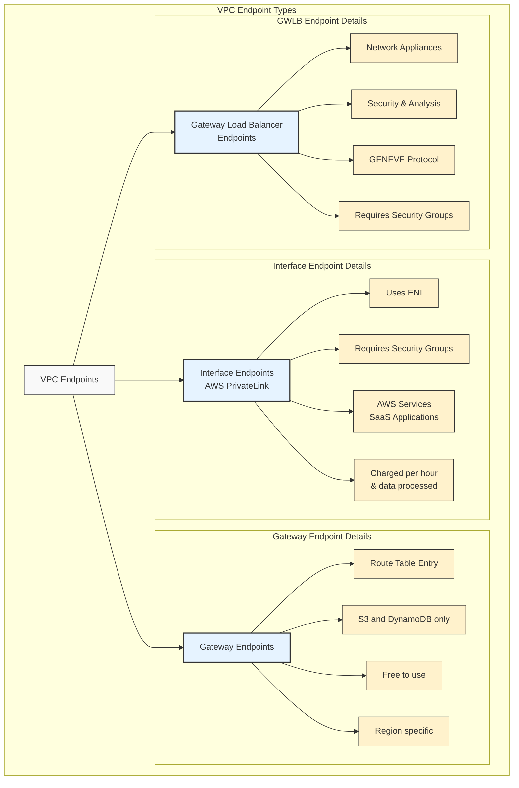

# VPC endpoints

There are 3 types of VPC endpoints in AWS:

### Interface Endpoints (Powered by AWS PrivateLink):

* Creates an ENI (Elastic Network Interface) in your VPC
* Used for accessing services using private IP addresses
* Requires security groups
* Commonly used for: SaaS services, AWS services like CloudWatch, SNS, SQS, etc.
* Incurs hourly charges and data processing fees

## Gateway Endpoints:

* A gateway that you specify as a target for a route in your route table
* Only supports two AWS services:
  * Amazon S3
  * DynamoDB
* Free to use
* Region-specific
* Does not require security groups

## Gateway Load Balancer Endpoints:

* Used for deploying, scaling, and managing third-party network virtual appliances
* Examples include: firewalls, intrusion detection systems, deep packet inspection systems
* Uses the GENEVE protocol on port 6081
* Requires security groups
* Commonly used for security appliances and network analysis tools

Key differences in use cases:

* Interface Endpoints: When you need private access to AWS or SaaS services
* Gateway Endpoints: When you need free, highly available access to S3 or DynamoDB
* Gateway Load Balancer Endpoints: When you need to insert security or network analysis appliances into your traffic flow
