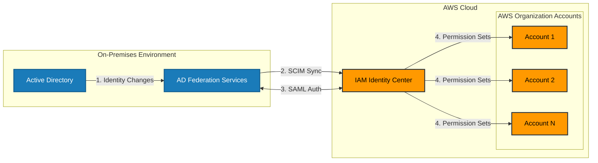

# SCIM

SCIM (System for Cross-domain Identity Management) is a standardized protocol that automates the exchange of user identity information between identity providers (like Active Directory) and cloud applications (like AWS).

Here's how it works:

1. Without SCIM:
   * When a new employee joins, an admin must manually create accounts in both Active Directory and AWS
   * When an employee leaves, accounts must be manually deactivated in both systems
   * Group membership changes require manual updates in both places
   * This manual process is time-consuming and prone to errors
2. With SCIM:
   * User management is automated and synchronized
   * When you add/remove users in Active Directory:
     * Changes automatically propagate to AWS
     * User accounts are automatically created/deactivated
     * Group memberships are automatically updated
   * All identity information stays in sync without manual intervention
3. Key Benefits:
   * Reduces administrative overhead
   * Eliminates manual errors
   * Improves security by ensuring terminated employees lose access immediately
   * Maintains consistency across systems
   * Enables real-time user provisioning and deprovisioning
4. In AWS IAM Identity Center:
   * SCIM endpoint is provided by AWS
   * You configure your Active Directory to communicate with this endpoint
   * Supports attributes like username, email, groups, and roles
   * Changes in Active Directory are automatically reflected in AWS access

This automatic provisioning is crucial for large organizations as it ensures consistent identity management and reduces security risks associated with manual user management.
