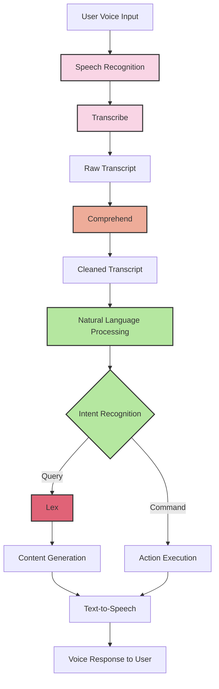
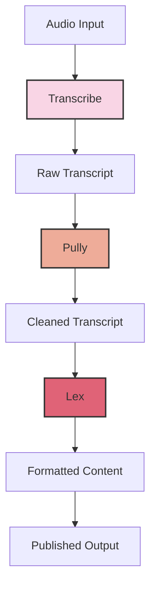

# Transcribe, Polly, Lex

## AWS Audio & Conversational AI Services

### Amazon Transcribe

Converts audio and video into text using automatic speech recognition (ASR).

### Amazon Polly

[Polly](https://aws.amazon.com/polly/) (Generate speech) is the voice box that turns the responses into speech:

* Text-to-speech service that creates lifelike speech
* Supports multiple languages and accents
* Natural-sounding voices for various applications
* Used for:
  * Audio content creation
  * Voice response systems
  * E-learning materials
  * Accessibility solutions

### Amazon Lex

Lex is the brain that understands and processes conversations.

\

[Lex](https://aws.amazon.com/pm/lex/) (AI conversational application - chatbox):

* Conversational AI service for building chatbots and voice interfaces
* Powers technology behind Amazon Alexa
* Key features:
  * Natural language understanding
  * Speech recognition
  * Dialog management
  * Integration with AWS services
* Common uses:
  * Customer service bots
  * Virtual assistants
  * Automated information systems
  * Interactive voice response (IVR)

<figure><figcaption></figcaption></figure>

Lex input types are: Text and Speech

Lex output is JSON structured data containing:

1. Text Response
   * Plain text messages
   * Bot's responses to user queries
2. Dialog State
   * ElicitIntent
   * ElicitSlot
   * ConfirmIntent
   * Fulfilled
   * Failed
3. Slot Data
   * Captured slot values
   * Slot validation results
4. Intent Information
   * Identified intent name
   * Confidence scores
   * Fulfillment states
5. Response Cards
   * Buttons
   * Images
   * Formatted visual elements
6. Session Attributes
   * Context information
   * Session state data
   * Custom attributes

| Input Type | Example Input                                | Intent                | Slot Values                                                        | Output Type                | Example Output                                                                                                        | Use Case               |
| ---------- | -------------------------------------------- | --------------------- | ------------------------------------------------------------------ | -------------------------- | --------------------------------------------------------------------------------------------------------------------- | ---------------------- |
| Text       | "Book a table for 4 tomorrow at 7 PM"        | BookRestaurant        | 
- Date: tomorrow - Time: 7 PM - PartySize: 4
          | Text                       | "I've booked a table for 4 tomorrow at 7 PM. Your confirmation number is #12345."                                     | Restaurant Reservation |
| Speech     | "I want to order a large pepperoni pizza"    | OrderPizza            | 
- Size: large - Topping: pepperoni
                       | Text + Card                | 
- Text: "Your pizza order total is $18.99" - Card: Shows pizza image, price, confirm button
                 | Food Ordering          |
| Text       | "What's the balance in my checking account?" | CheckBalance          | - AccountType: checking                                            | Text + Session Attributes  | 
- Text: "Your checking account balance is $1,234.56" - Session: Stores account type for follow-up questions
 | Banking                |
| Speech     | "Book a flight to Seattle next Friday"       | BookFlight            | 
- Destination: Seattle - Date: next Friday
               | ElicitSlot                 | "What time would you like to depart?"                                                                                 | Travel Booking         |
| Text       | "I need to reschedule my appointment"        | RescheduleAppointment | - Action: reschedule                                               | ElicitSlot + Card          | 
- Text: "I can help you reschedule. Please select a new date" - Card: Calendar picker
                       | Healthcare             |
| Text       | "Track my order #123456"                     | TrackOrder            | - OrderId: 123456                                                  | Text + Response Card       | 
- Text: "Your order is in transit" - Card: Shows tracking map
                                               | E-commerce             |
| Speech     | "Turn on the living room lights"             | SmartHomeControl      | 
- Device: lights - Location: living room - Action: on
 | Text + Fulfillment         | "Turning on the living room lights"                                                                                   | Smart Home             |
| Text       | "What's the weather like?"                   | GetWeather            | None (Eliciting)                                                   | ElicitSlot                 | "For which city would you like to know the weather?"                                                                  | Weather Info           |
| Text       | "I want to file a complaint"                 | FileComplaint         | None (Initial)                                                     | Text + Intent Confirmation | "I understand you want to file a complaint. Is that correct?"                                                         | Customer Service       |
| Speech     | "Transfer $100 to savings"                   | TransferMoney         | 
- Amount: 100 - ToAccount: savings
                       | ConfirmIntent              | "Do you want to transfer $100 to your savings account?"                                                               | Banking Transfer       |

##

## Alexa example

### Example 2

