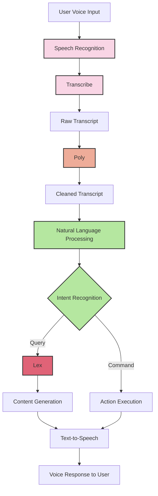
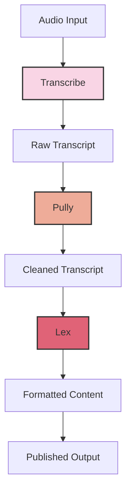

# Transcribe, Polly, Lex

## AWS Audio & Conversational AI Services

### Amazon Transcribe

Converts audio and video into text using automatic speech recognition (ASR).

### Amazon Polly

[Polly](https://aws.amazon.com/polly/) (Generate speech):

* Text-to-speech service that creates lifelike speech
* Supports multiple languages and accents
* Natural-sounding voices for various applications
* Used for:
  * Audio content creation
  * Voice response systems
  * E-learning materials
  * Accessibility solutions

### Amazon Lex

[Lex](https://aws.amazon.com/pm/lex/) (AI conversational application - chatbox):

* Conversational AI service for building chatbots and voice interfaces
* Powers technology behind Amazon Alexa
* Key features:
  * Natural language understanding
  * Speech recognition
  * Dialog management
  * Integration with AWS services
* Common uses:
  * Customer service bots
  * Virtual assistants
  * Automated information systems
  * Interactive voice response (IVR)

<figure><figcaption></figcaption></figure>

## Alexa example

### Example 2

