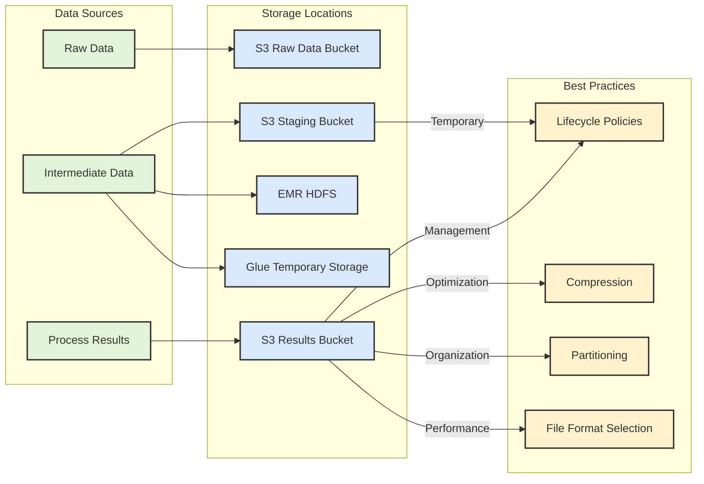

# Glue and EMR

Results from Glue or EMR jobs, as well as intermediate processing data, should typically be stored in S3. Let me create a diagram showing the common data storage patterns:

Here's the recommended approach for storing different types of data:

1. Raw Data:
   * Store in S3 raw data bucket
   * Maintain original format
   * Apply appropriate retention policies
2. Intermediate/Temporary Data:
   * EMR: Use HDFS for processing, then move final results to S3
   * Glue: Uses temporary storage in S3 automatically
   * Use staging buckets with short retention periods
3. Process Results:
   * Store in dedicated S3 results bucket
   * Use appropriate file formats (Parquet, ORC)
   * Implement partitioning strategy
   * Apply compression
   * Consider access patterns

Best practices include:

* Clear bucket organization (raw, staging, processed)
* Lifecycle policies to manage storage costs
* Appropriate data formats for query performance
* Partitioning for query efficiency
* Security controls at each stage

Remember to set up appropriate lifecycle rules to clean up temporary/intermediate data and manage storage costs effectively.
