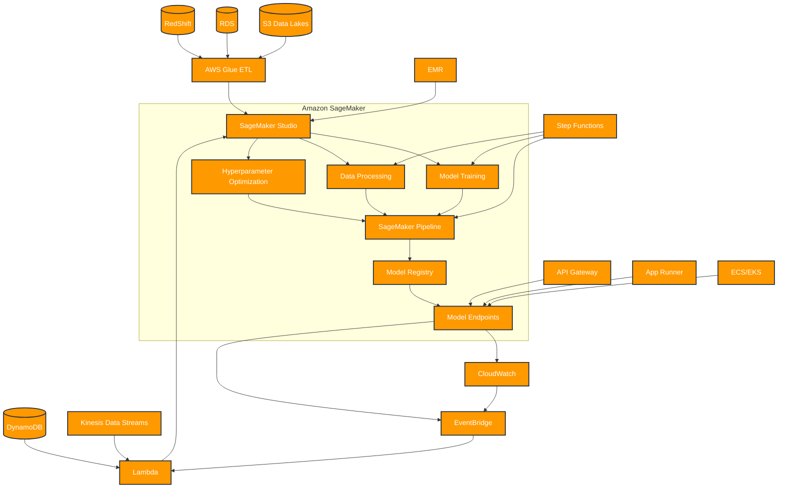

# Integration patterns with Amazon SageMaker

An example of end-to-end AWS service integration patterns with Amazon SageMaker as the central ML service is:

I've created a diagram showing the key integration patterns for Amazon SageMaker. Here's a breakdown of the main components and flows:

1. Data Sources:

* S3 Data Lakes for unstructured data
* RDS and RedShift for structured data
* DynamoDB for NoSQL data
* Kinesis for real-time streaming data

2. Data Processing Layer:

* AWS Glue for ETL operations
* EMR for big data processing
* Lambda for serverless transformations

3. SageMaker Core Components:

* SageMaker Studio for development environment
* Model Training for building ML models
* Data Processing for feature engineering
* Hyperparameter Optimization for model tuning
* SageMaker Pipeline for ML workflows
* Model Registry for versioning
* Model Endpoints for deployment

4. Deployment & Monitoring:

* CloudWatch for metrics and logging
* EventBridge for event orchestration
* Step Functions for workflow automation

5. Application Integration:

* API Gateway for RESTful interfaces
* App Runner for containerized applications
* ECS/EKS for container orchestration

Would you like me to add any specific integration patterns or modify the existing flows?
