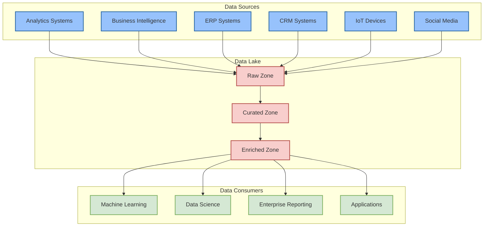
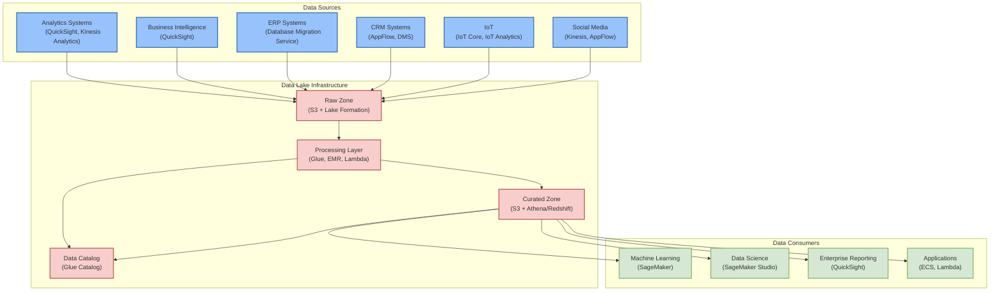

# AI, Analytics, Big Data, ML

## ELT: The Modern Data Pipeline Approach

ELT represents a significant evolution in data integration methodology, particularly for machine learning applications. Unlike its predecessor ETL (Extract, Transform, Load), ELT postpones data transformation until after the loading phase, offering greater flexibility and efficiency in data processing.

**Key Advantages of ELT**

The primary advantage of ELT lies in its ability to maintain raw data integrity while optimizing resource utilization. When organizations collect data from multiple sources, especially in large volumes, immediate transformation can be both costly and potentially counterproductive. By loading raw data directly into a **data lake's staging zone**, organizations preserve the original data state while **deferring transformation costs** until specific business needs arise.

**ELT vs. ETL: A Strategic Comparison**

While ETL transforms data before loading, potentially optimizing for speed and reducing storage costs, ELT offers distinct benefits:

* Preservation of raw data for future use cases
* Flexibility to transform data based on evolving business requirements
* Reduced initial processing overhead
* Support for advanced analytics and machine learning workflows

**Practical Implementation**

In an ELT framework, organizations can create specific **views or data frames** to serve particular business needs. These transformations can be performed on-demand, whether for generating specific reports or **creating optimized datasets for machine learning models**. The transformed data can either be used directly or stored back in the data lake for repeated use.

This approach particularly shines in modern cloud environments where storage is relatively inexpensive compared to computation costs, allowing organizations to maintain comprehensive data repositories while optimizing transformation expenses.

<figure><figcaption></figcaption></figure>







We can thinking about AI, Analytics, Big Data and ML in this way:

* Analytics is the overall goal (getting insights from data)
* Big Data provides the infrastructure and methods to handle massive datasets
* Machine Learning is one powerful tool used within analytics to find patterns and make predictions
* Artificial Intelligence (AI) is the broader field that aims to create systems that can simulate human intelligence, with ML being one of its key subsets that focuses specifically on learning from data

You could visualize it as a hierarchy:

```
AI (Broadest: Creating intelligent systems)
    ↳ Analytics (Getting insights from data)
        ↳ Big Data (Infrastructure & Processing)
            ↳ Machine Learning (Learning patterns from data)
```

Another way to frame it:

* AI is like the brain (general intelligence capability)
* Analytics is like the reasoning process
* Big Data is like the memory and processing power
* ML is like the learning mechanism


## Big Data Characteristics (The 3 Vs):

1. Volume: Handles massive datasets (terabytes to petabytes)
2. Variety: Supports multiple data types (structured, semi-structured, unstructured)
3. Velocity: Efficiently processes data ingestion, storage, and analysis


### Analytics and business intelligence services&#x20;

The main analytics and business intelligence services in AWS are:

Data Analytics (what might happen) services:

1. Amazon Redshift - Fully managed data warehouse service for large-scale analytics
2. Amazon EMR (Elastic MapReduce) - Big data processing using Apache frameworks like Hadoop, Spark
3. Amazon Athena - Interactive query service for analyzing data in S3 using standard SQL
4. Amazon Kinesis - Real-time data streaming and analytics
5. Amazon OpenSearch Service (formerly Elasticsearch) - Search and analytics engine
6. Amazon MSK (Managed Streaming for Apache Kafka) - Fully managed Apache Kafka service

Business Intelligence & Visualization (what has happen):

1. Amazon QuickSight - Cloud-native BI service with ML insights
2. AWS Glue - Fully managed ETL (Extract, Transform, Load) service
3. Amazon DataZone - Data governance and sharing service

Data Lake Solutions:

1. AWS Lake Formation - Helps build, manage, and secure data lakes
2. Amazon S3 - Object storage that serves as the foundation for data lakes

Machine Learning Analytics:

1. Amazon SageMaker - Build, train, and deploy machine learning models
2. Amazon Comprehend - Natural language processing and text analytics

Each of these services has specific use cases:

* For SQL-based ad-hoc querying of data in S3, Athena is ideal
* For traditional data warehousing, Redshift is the go-to service
* For real-time analytics, Kinesis is the primary choice
* For business dashboards and visualizations, QuickSight is commonly used

