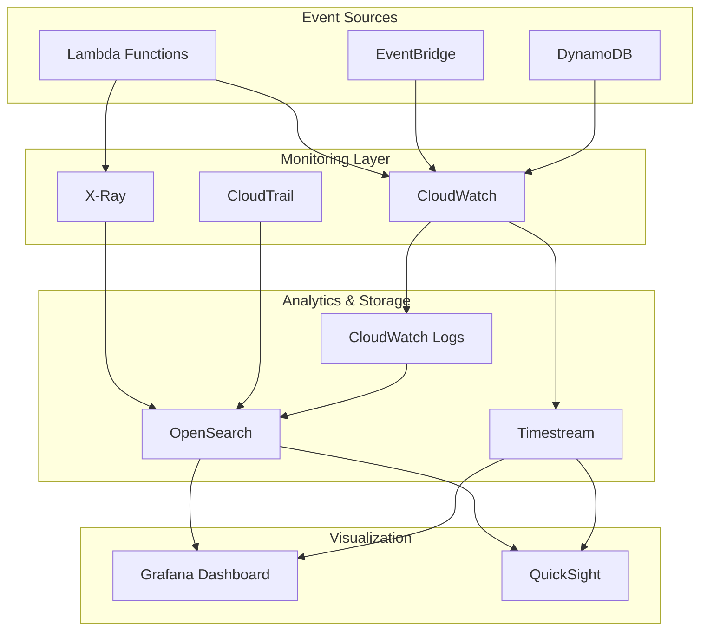

# Monitoring and visualization solution for your event-driven architecture (EDA) in AWS.

The monitoring and visualization solution for your event-driven architecture (EDA) in AWS look like:




Here's a comprehensive approach to monitoring your EDA:

1. **Core Monitoring Services**:
   * CloudWatch: For metrics and logs from Lambda, EventBridge, and DynamoDB
   * X-Ray: For distributed tracing and service map visualization
   * CloudTrail: For API activity tracking
2.  **Implementation Steps**:

    a) **Lambda Functions**:

    ```python
    # Add correlation IDs to track business flows
    def lambda_handler(event, context):
        correlation_id = event.get('correlation_id', str(uuid.uuid4()))
        logger.info({
            'correlation_id': correlation_id,
            'business_event': 'process_start',
            'timestamp': datetime.now().isoformat()
        })
    ```

    b) **CloudWatch Metrics**:

    ```bash
    # Custom business metrics
    aws cloudwatch put-metric-data \
        --namespace "BusinessMetrics" \
        --metric-name "OrderProcessingTime" \
        --value 100 \
        --dimensions ProcessType=Standard
    ```
3. **Real-time Visualization Options**:
   * **Grafana**:
     * Best for technical teams
     * Supports multiple data sources
     * Real-time dashboards
     * Custom alerting
   * **Amazon QuickSight**:
     * Better for business users
     * ML-powered insights
     * Easy sharing and embedding
4. **Best Practices**:
   * Use correlation IDs across all components
   * Create custom metrics for business KPIs
   * Set up composite alarms for complex scenarios
   * Use metric filters on CloudWatch Logs
   * Store time-series data in Timestream for better performance
5. **Business Flow Tracking**:
   * Create state machines using Step Functions for complex workflows
   * Use DynamoDB streams to track changes
   * Implement dead letter queues (DLQ) for failed events
   * Set up CloudWatch dashboards for business metrics

For real-time visualization, I'd recommend:

1. **Technical Monitoring**: Grafana connected to:
   * CloudWatch for metrics
   * OpenSearch for logs
   * Timestream for time-series data
2. **Business Monitoring**: QuickSight for:
   * Business KPIs
   * Trend analysis
   * Custom reports

