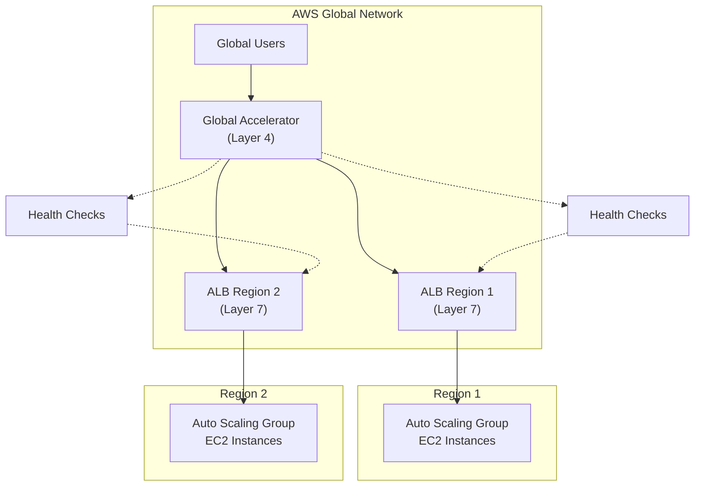

# Gaming application

\
A company has a popular gaming platform running on AWS. The application is sensitive to latency because latency can impact the user experience and introduce unfair advantages to some players. The application is deployed in every AWS Region. It runs on Amazon EC2 instances that are part of Auto Scaling groups configured behind Application Load Balancers (ALBs). A solutions architect needs to implement a mechanism to monitor the health of the application and redirect traffic to healthy endpoints. Which solution meets these requirements?

**A.** Configure an accelerator in AWS Global Accelerator. Add a listener for the port that the application listens on and attach it to a Regional endpoint in each Region. Add the ALB as the endpoint.

Global Accelerator is specifically designed for:

* Improving availability and performance for applications that need static IP addresses
* Gaming applications (one of the primary use cases)
* IoT applications
* Voice over IP

Key relevant features that confirm our answer:

1. "Global Accelerator automatically checks the health of your applications and routes user traffic only to healthy application endpoints."
2. "AWS Global Accelerator improves performance for a wide range of applications over TCP or UDP by proxying packets at the edge to applications running in one or more AWS Regions."
3. "Global Accelerator is a good fit for non-HTTP use cases, such as gaming (UDP), IoT (MQTT), or Voice over IP"
4. "Global Accelerator is also a good fit for HTTP use cases that specifically require static IP addresses or deterministic, fast regional failover."
5. "You can add the following types of AWS resources as endpoints for your accelerator:
   * Application Load Balancers
   * Network Load Balancers
   * Amazon EC2 instances
   * Elastic IP addresses"

