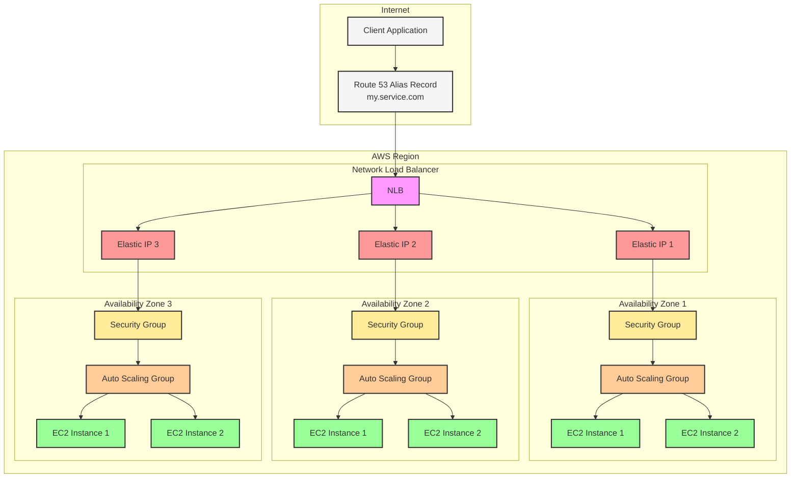
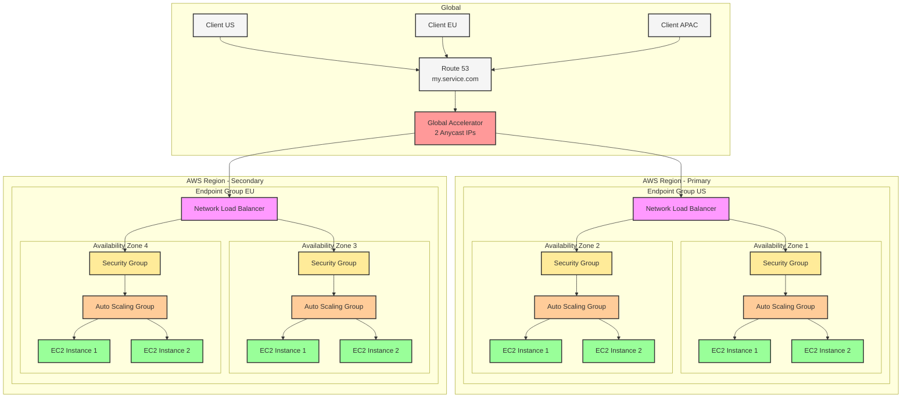
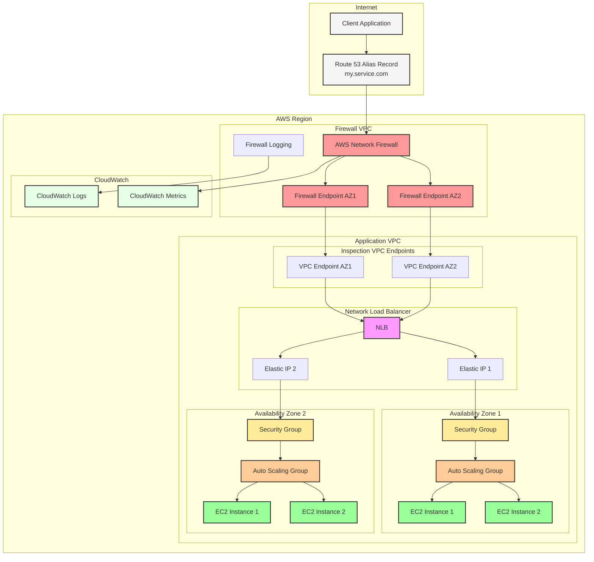
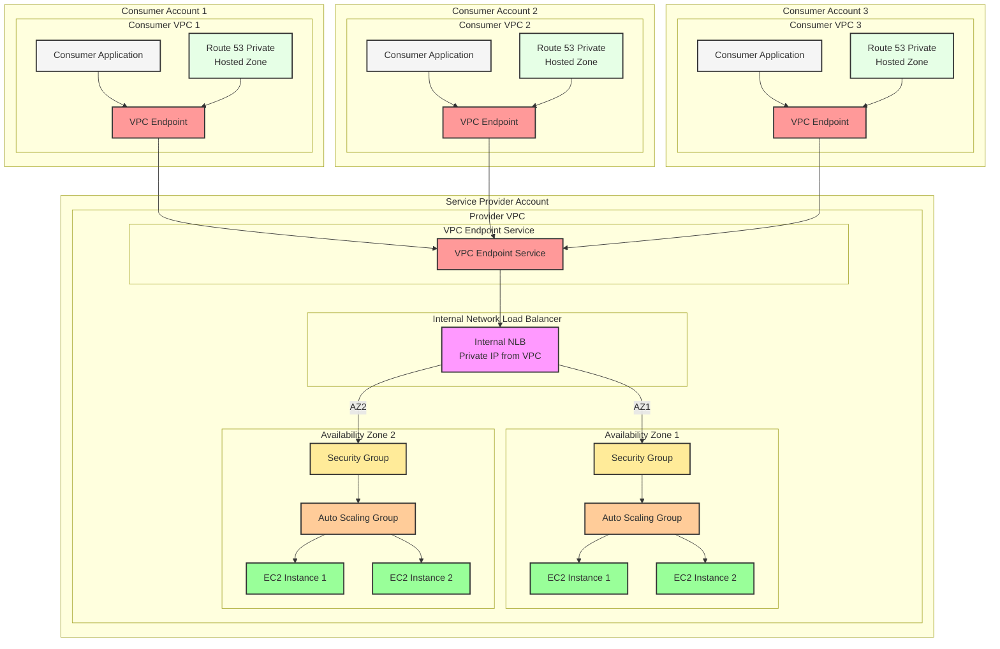
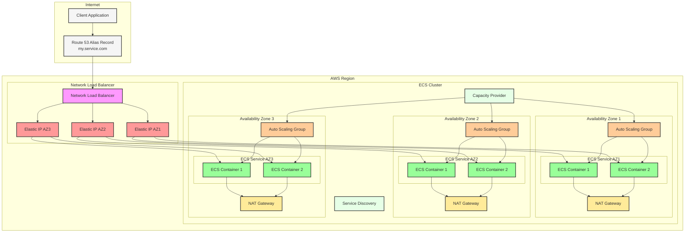

# HA TCP with Redundant DNS

### Core Requirements

* TCP protocol support on static port
* High availability across multiple Availability Zones
* Public DNS accessibility (e.g., my.service.com)
* Fixed IP addressing for third-party allow listing
* Cross-AZ redundancy within a single region

### Option 1: NLB with Elastic IP per AZ (Recommended)

#### Architecture Components

* Network Load Balancer with static Elastic IPs per AZ
* EC2 instances in Auto Scaling Group across AZs
* Route 53 Alias record pointing to NLB

#### Implementation Details

1. Network Load Balancer Configuration
   * Create NLB and enable cross-zone load balancing
   * Assign Elastic IP to each subnet in each AZ
   * Configure TCP listener on required port
   * Set up target group with health checks
2. Compute Layer
   * Launch EC2 instances in Auto Scaling Group
   * Distribute across multiple AZs
   * Configure instance health checks
   * Implement security groups for TCP port access
3. DNS Configuration
   * Create Route 53 Alias record pointing to NLB
   * Enable health checks
   * Configure failover if needed

#### Advantages

* Fixed, predictable IP addresses for allow listing
* Native TCP support
* Automatic failover
* Low latency through zonal IP addressing
* AWS-managed high availability

#### Limitations

* Cost of Elastic IPs
* Limited to 50 IPs per region (can be increased)

### Option 2: Global Accelerator with Endpoint Groups

#### Architecture Components

* AWS Global Accelerator (providing fixed IPs)
* Network Load Balancer as endpoint
* EC2 instances in Auto Scaling Group
* Route 53 for DNS management

#### Implementation Details

1. Global Accelerator Setup
   * Create accelerator (provides 2 fixed anycast IPs)
   * Configure listener for TCP port
   * Create endpoint group in region
   * Add NLB as endpoint
2. Network Load Balancer Layer
   * Deploy NLB across AZs
   * Configure target groups
   * Set up health checks
3. Compute Layer
   * EC2 instances in Auto Scaling Group
   * Multi-AZ deployment
   * Security group configuration

#### Advantages

* Only 2 IPs to allow list globally
* Built-in DDoS protection
* Global availability
* Automatic failover
* Better latency for global users

#### Limitations

* Higher cost compared to NLB-only solution
* More complex setup

### Option 3: Network Firewall with NLB

#### Architecture Components

* AWS Network Firewall
* Network Load Balancer
* EC2 instances in Auto Scaling Group
* Route 53 for DNS

#### Implementation Details

1. Network Firewall Configuration
   * Deploy Network Firewall
   * Configure stateful rules for TCP
   * Set up logging and monitoring
2. Load Balancer Layer
   * NLB deployment across AZs
   * Target group configuration
   * Health check setup
3. Compute Resources
   * EC2 Auto Scaling Group
   * Multi-AZ distribution
   * Instance security configuration

#### Advantages

* Advanced traffic filtering
* Detailed network monitoring
* Centralized security management
* Fixed IP addresses

#### Limitations

* Additional cost for Network Firewall
* More complex network architecture
* Higher latency due to additional hop

### Option 4: Private Link Service

#### Architecture Components

* AWS PrivateLink service
* Network Load Balancer
* EC2 instances
* Route 53 Private Hosted Zone

#### Implementation Details

1. PrivateLink Configuration
   * Create VPC endpoint service
   * Associate NLB
   * Configure allowed principals
2. Service Provider Setup
   * NLB deployment
   * Target group configuration
   * Security group setup
3. Consumer Setup
   * VPC endpoint creation
   * DNS configuration
   * Network ACL configuration

#### Advantages

* Private connectivity
* No public IP exposure
* Highly secure
* Service provider control

#### Limitations

* More complex setup
* Both parties need to be on AWS
* Regional service
* Higher cost

### Option 5: ECS with Network Load Balancer and Static IPs

#### Architecture Components

* Amazon ECS Cluster
* Network Load Balancer with Elastic IPs
* ECS Services and Tasks
* Route 53 for DNS management

#### Implementation Details

1. Network Configuration
   * Create VPC with public and private subnets
   * Assign Elastic IPs to NLB per AZ
   * Configure NAT Gateways for container internet access
2. ECS Cluster Setup
   * Deploy ECS cluster across multiple AZs
   * Use EC2 launch type for predictable networking
   * Configure capacity providers
   * Set up Auto Scaling groups for ECS hosts
3. Container Configuration
   * Define task definitions with TCP port mapping
   * Configure service discovery
   * Set up ECS services with desired count
   * Enable container health checks
4. Load Balancer Setup
   * Deploy Network Load Balancer
   * Assign Elastic IPs per AZ
   * Configure TCP listener
   * Create target groups for ECS services
5. DNS Configuration
   * Create Route 53 Alias record
   * Point to NLB
   * Configure health checks

#### Advantages

* Container orchestration benefits
* Fixed IP addresses for allow listing
* Auto scaling capabilities
* Easy service updates
* Built-in health checks and recovery

#### Limitations

* More complex than EC2-only solution
* Requires ECS-specific knowledge
* Container networking considerations
* Higher operational overhead

### Best Practices Across All Options

#### High Availability

* Deploy across minimum three AZs
* Implement proper health checks
* Configure automatic failover
* Use Auto Scaling Groups

#### Security

* Implement least privilege access
* Enable VPC Flow Logs
* Regular security audits
* DDoS protection configuration

#### Monitoring

* CloudWatch metrics
* Health check alerts
* Latency monitoring
* Connection tracking

#### Cost Optimization

* Right-size instances
* Monitor traffic patterns
* Optimize AZ usage
* Regular cost analysis

### Implementation Decision Matrix

| Requirement       | NLB w/EIP | Global Accelerator | Network Firewall | PrivateLink |
| ----------------- | --------- | ------------------ | ---------------- | ----------- |
| Fixed IPs         | Yes       | Yes                | Yes              | N/A         |
| Global Reach      | No        | Yes                | No               | No          |
| Setup Complexity  | Low       | Medium             | High             | High        |
| Cost              | Low       | Medium             | High             | Medium      |
| Security Features | Basic     | Advanced           | Advanced         | Advanced    |
| Latency           | Low       | Low                | Medium           | Low         |

### Conclusion

For most standard TCP service deployments, the NLB with Elastic IP per AZ option provides the best balance of functionality, cost, and complexity. However, specific requirements around global availability (Global Accelerator), advanced security (Network Firewall), or private connectivity (PrivateLink) might make other options more suitable.

The choice between these options should be based on:

* Geographic distribution requirements
* Security and compliance needs
* Budget constraints
* Operational complexity tolerance
* Performance requirements
* Integration with existing infrastructure
