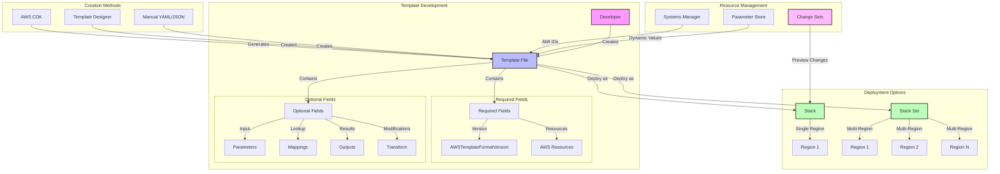

# AWS CloudFormation (Immutable AWS Architecture)

### Core Concepts

* Enables Infrastructure as Code (IaC) using JSON or YAML template files
* Promotes stateless, immutable architecture that can be replicated across AWS regions
* Templates are version-controlled and can be treated as application code

### Best Practices

1. Resource Identification
   * Avoid hardcoding resource IDs (AMIs, snapshots, etc.)
   * Use dynamic references through:
     * Mapping section in templates
     * AWS Systems Manager Parameter Store
     * AWS-provided pseudo parameters
     * Dynamic references (e.g., `!Ref`, `!GetAtt`)
2.  Deployment Units

    ```yaml
    # Example Stack Template
    Resources:
      MyVPC:
        Type: AWS::EC2::VPC
        Properties:
          CidrBlock: !Ref VPCCidrBlock
          EnableDnsHostnames: true
          Tags:
            - Key: Environment
              Value: !Ref Environment
    ```

    * Stacks: Regional deployment units
    * Stack Sets: Multi-region, multi-account deployments
      * Requires administrator account
      * Enables centralized management
      * Supports automatic drift detection
3.  Template Structure Required Fields:

    ```yaml
    AWSTemplateFormatVersion: '2010-09-09'
    Resources:
      # At least one resource required
    ```

    Optional Fields:

    ```yaml
    Description: 'Stack description'
    Parameters:
      EnvironmentType:
        Type: String
        AllowedValues: [dev, prod]

    Mappings:
      RegionMap:
        us-east-1:
          AMI: ami-12345678

    Outputs:
      VPCId:
        Description: 'VPC ID'
        Value: !Ref MyVPC

    Transform:
      - AWS::Serverless-2016-10-31
    ```

### Key Benefits

1. Cost Management
   * Resource tagging
   * Cost allocation
   * Stack-level cost tracking
2. Deployment Automation
   * Repeatable deployments
   * Integration with CI/CD pipelines
   * Rollback capabilities
3.  Change Management

    ```yaml
    # Example Change Set Preview
    Changes:
      - ResourceChange:
          Action: Add
          LogicalResourceId: NewSecurityGroup
          ResourceType: AWS::EC2::SecurityGroup
    ```

    * Change Sets preview modifications
    * Impact assessment before implementation
    * Reduces deployment risks

### Template Development

1. Creation Methods:
   * Manual template writing
   * AWS CloudFormation Designer (visual editor)
   * AWS CDK (generates CloudFormation templates)
2.  Validation Tools:

    ```bash
    # Template validation command
    aws cloudformation validate-template --template-body file://template.yaml
    ```

    * Built-in template validation
    * cfn-lint for local validation
    * CloudFormation Guard for policy checks
3. Advanced Features:
   * Custom resources
   * Nested stacks
   * Stack policies
   * Drift detection



