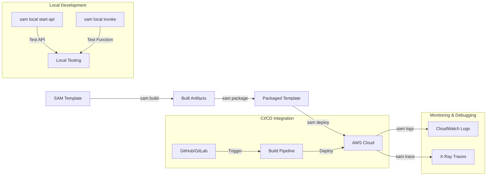
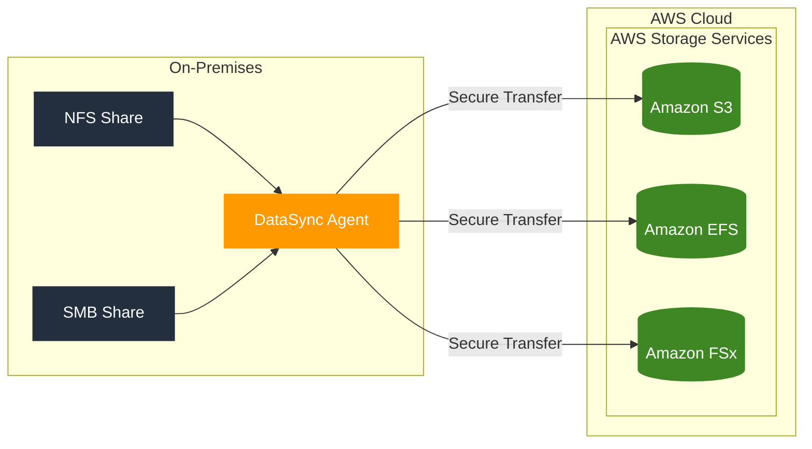

# SAM

I'll review, correct, and enhance the explanation of AWS SAM with more technical details and practical examples.

## AWS Serverless Application Model (SAM)

### Overview

AWS SAM is an open-source framework that extends CloudFormation to simplify serverless application development. Here's a comprehensive breakdown:

### Key Components

1. Template Specification

```yaml
# Example SAM Template
AWSTemplateFormatVersion: '2010-09-09'
Transform: AWS::Serverless-2016-10-31

Resources:
  MyFunction:
    Type: AWS::Serverless::Function
    Properties:
      Handler: index.handler
      Runtime: nodejs18.x
      Events:
        ApiEvent:
          Type: Api
          Properties:
            Path: /hello
            Method: get
```

2. Resource Types

* `AWS::Serverless::Function` (Lambda)
* `AWS::Serverless::Api` (API Gateway)
* `AWS::Serverless::HttpApi` (HTTP API)
* `AWS::Serverless::SimpleTable` (DynamoDB)
* `AWS::Serverless::StateMachine` (Step Functions)
* `AWS::Serverless::LayerVersion` (Lambda Layers)

3. Local Development Features

```bash
# Local testing commands
sam local start-api    # Start local API Gateway
sam local invoke      # Test Lambda functions
sam local start-lambda # Start local Lambda endpoint
```

4. Development Lifecycle



5. Advanced Features

* Policy Templates

```yaml
  MyFunction:
    Type: AWS::Serverless::Function
    Properties:
      Policies:
        - S3ReadPolicy:
            BucketName: !Ref MyBucket
        - DynamoDBCrudPolicy:
            TableName: !Ref MyTable
```

* Layers Support

```yaml
  MyLayer:
    Type: AWS::Serverless::LayerVersion
    Properties:
      ContentUri: ./layer
      CompatibleRuntimes:
        - nodejs18.x
```

6. Security Features

* Built-in IAM role generation
* Security policy templates
* Integration with AWS security services

7. Development Tools

* SAM CLI for local testing
* AWS Toolkit integration (VS Code, JetBrains, etc.)
* CloudFormation Designer compatibility

8. Best Practices

* Use environment variables for configuration
* Implement proper error handling
* Set appropriate timeouts and memory
* Use layers for shared code
* Enable X-Ray tracing

9. Debugging Capabilities

```bash
# Debugging commands
sam logs -n MyFunction    # View logs
sam trace                 # View traces
```

10. Deployment Options

```bash
# Deployment commands
sam deploy --guided      # Interactive deployment
sam deploy --config-file # Use config file
```

11. Integration Points

* CI/CD pipelines (AWS CodePipeline, GitHub Actions)
* AWS X-Ray for tracing
* CloudWatch for monitoring
* AWS Step Functions for orchestration



