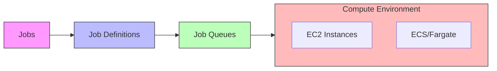

# Batch

## AWS Batch Overview

A fully managed service for running batch computing workloads on AWS infrastructure (EC2 or ECS/Fargate).

### Key Benefits

1. Zero infrastructure management overhead
2. Automatic provisioning and scaling
3. No installation required

### Core Components

#### 1. Jobs

* Basic unit of work in AWS Batch
* Can be implemented as:
  * Shell scripts
  * Executable files
  * Docker containers

#### 2. Job Definitions

* Blueprints for job execution
* Specify:
  * Resource requirements
  * Environment configuration
  * Job parameters

#### 3. Job Queues

* Holding area for submitted jobs
* Jobs wait here until:
  * Resources are available
  * Scheduling conditions are met
* Can set multiple priority levels

#### 4. Compute Environments

Types:

1. **Managed**
   * AWS handles capacity and instance management
   * Automatic scaling
   * ECS/Fargate support
2. **Unmanaged**
   * User controls compute resources
   * Greater customization options
   * Manual scaling

Here's a visual representation of how these components interact:

<figure><figcaption></figcaption></figure>

| Fargate                                 | EC2                                       |
| --------------------------------------- | ----------------------------------------- |
| Recommended approach for MOST workloads | Need more control over instance selection |
| Requires fast start times (<30 seconds) | Elastic Fabric Adapter                    |
| 16 vCPU or less                         | custom AMIs                               |
| no GPUs                                 | GPUs                                      |
| max 120 GiB of memory                   | High levels of cocurrency                 |
|                                         | access to Linux Parameters                |

| AWS Batch                                 | AWS Lambda                                                                                            |
| ----------------------------------------- | ----------------------------------------------------------------------------------------------------- |
| no time limit                             | 15 min execution time                                                                                 |
|                                           | limited native disk space, and EFS requires functions live within a VPC. It addes overhead and costs. |
| Batch uses Docker so can have any runtime | fully serverless with limited runtimes                                                                |

| Batch Managed                                                  | Batch Unmanage                                              |
| -------------------------------------------------------------- | ----------------------------------------------------------- |
| AWS manages capacity and instance types                        | managed your own resouces                                   |
| Compute resource specs are defined when environment is created | AmI must meet ECS AMI specs                                 |
| ECS instances are launched into VPC  subnets                   | you manage everything                                       |
| Default is the most recetn and approved Amazon ECS AMI         | Good choice for extremely complex or specific requirements  |
| You can use own AMI                                            |                                                             |
|                                                                |                                                             |
|                                                                |                                                             |
