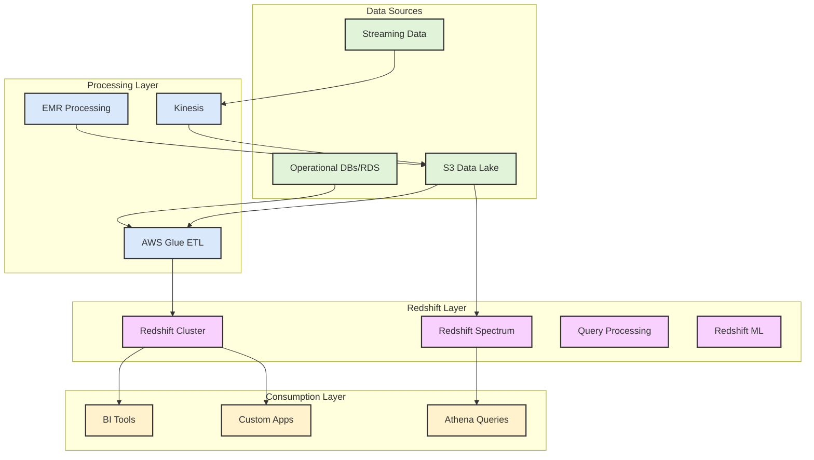

# Page 1

The Redshift's role in the analytics architecture and how it relates to other AWS analytics services is depicted below:

Redshift plays several key roles:

1. Enterprise Data Warehouse
   * Central repository for structured data
   * Optimized for complex analytical queries
   * Handles large-scale data aggregation
   * Supports concurrent user access
2. Query Engine
   * Processes complex SQL queries
   * Supports joins across multiple tables
   * Handles window functions and aggregations
   * Provides materialized views
3. Data Integration Hub
   * Connects with various data sources
   * Works with Redshift Spectrum for S3 data
   * Integrates with other AWS services
   * Supports federated queries
4. Performance Layer
   * Columnar storage for analytics
   * Massively parallel processing
   * Result caching
   * Automatic workload management

Common Use Cases:

* Business intelligence reporting
* Historical data analysis
* Complex analytical queries
* Real-time analytics dashboards
* Machine learning with Redshift ML

Would you like me to elaborate on any specific aspect of Redshift's role or its integration with other services?
