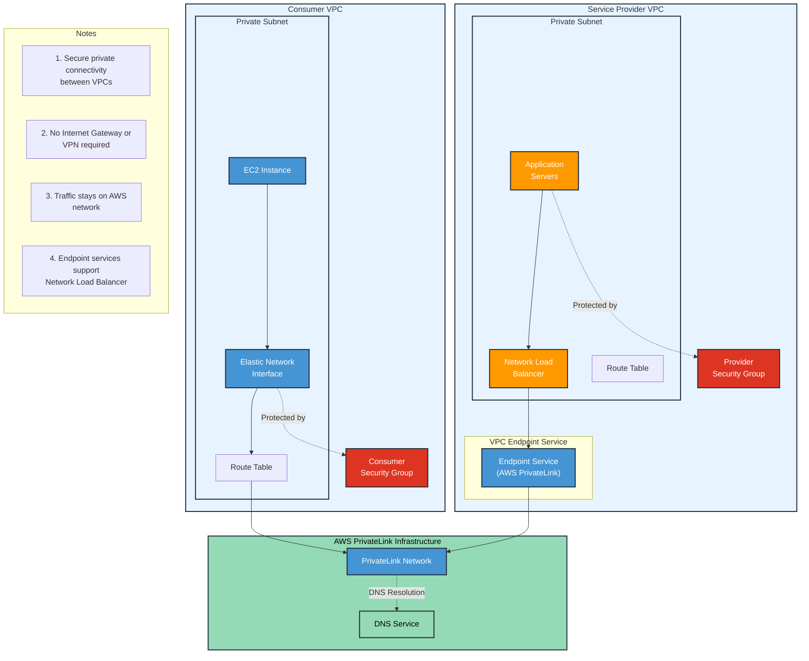

# PrivateLink

* The best way to expose a service VPC to tens, hundreds, or thousands of customer VPCs&#x20;
* Doesn't require VPC peering; no route tables, NAT gateways, internet gateways, etc.
* Requires a **Network Load Balancer** on the service VPC and an **ENI** on the customer VPC.

<figure><figcaption></figcaption></figure>

