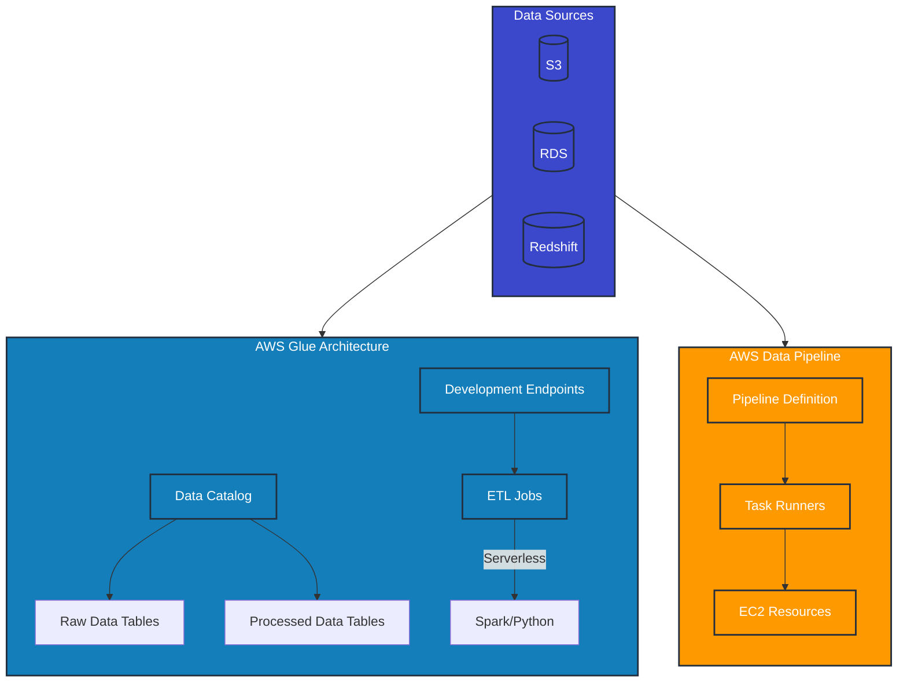

# ETL

## AWS Glue VS AWS Data Pipeline&#x20;

Glue replaces AWS Data Pipeline.

The diagram below shows how:

1. Glue provides a more integrated, serverless approach
2. Data Pipeline requires more manual configuration
3. Glue's Data Catalog provides central metadata management
4. Both can access the same data sources, but Glue offers more built-in capabilities

| ETL Solution                            | Type                                          | Key Features                                                             | Best For                                                            | Scalability | Ease of Use              |
| --------------------------------------- | --------------------------------------------- | ------------------------------------------------------------------------ | ------------------------------------------------------------------- | ----------- | ------------------------ |
| AWS Glue                                | Fully managed ETL service                     | Serverless, auto-scaling, visual ETL job creation                        | Large-scale data integration, data catalog                          | Automatic   | High                     |
| AWS Data Pipeline                       | Web service for data-driven workflows         | Supports on-premises and cloud-based data sources, scheduling            | Complex, multi-step data workflows                                  | Manual      | Medium                   |
| Amazon EMR (Elastic MapReduce)          | Big data platform                             | Supports various frameworks (Spark, Hive, etc.), can be used for ETL     | Large-scale data processing and ETL                                 | Manual      | Low (requires expertise) |
| AWS Batch                               | Fully managed batch computing service         | Can be used for ETL jobs, integrates with other AWS services             | Batch ETL jobs, especially compute-intensive ones                   | Automatic   | Medium                   |
| AWS Step Functions                      | Serverless workflow service                   | Can orchestrate ETL processes using other AWS services                   | Complex ETL workflows, especially those involving multiple services | Automatic   | Medium                   |
| Amazon Redshift                         | Data warehouse with ETL capabilities          | COPY command for data loading, stored procedures for transformations     | Large-scale data warehousing with built-in ETL                      | Manual      | Medium                   |
| AWS Lambda                              | Serverless compute service                    | Can be used for lightweight ETL tasks                                    | Small to medium-scale ETL, event-driven data processing             | Automatic   | High                     |
| Amazon DMS (Database Migration Service) | Database and data warehouse migration service | Can be used for ongoing replication, supports heterogeneous migrations   | Database migrations, continuous data replication                    | Automatic   | High                     |
| AWS Lake Formation                      | Data lake service                             | Automates many tasks in setting up a data lake, including data ingestion | Building, securing, and managing data lakes                         | Automatic   | High                     |
| Amazon AppFlow                          | Fully managed integration service             | Connects SaaS apps and AWS services                                      | SaaS data integration, no-code ETL for business users               | Automatic   | Very High                |
| AWS Transfer Family                     | Managed file transfer service                 | Can be part of ETL processes involving file transfers                    | Secure file-based ETL workflows                                     | Manual      | Medium                   |
| Amazon EventBridge Pipes                | Event-driven pipe service                     | Connects event producers to consumers with optional transform            | Real-time ETL, event-driven architectures                           | Automatic   | High                     |
