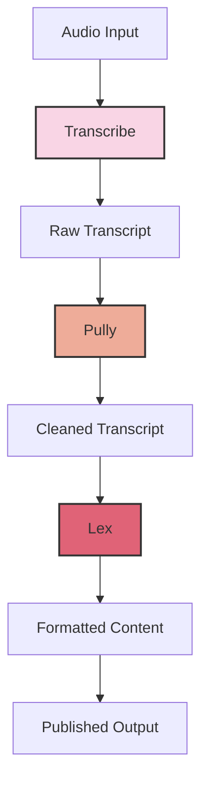

# Transcribe, Polly, Lex

* Transcribe is used to convert audios, videos and images into text.&#x20;
* Lex is the chat bots. A tool for formatting and preparing content for publication.
* Polly is a tool that cleans and processes the raw transcript by turning the text into lifelike speech using a variety of languages and accents.
* Polly:
  * Polly is a transcript editing and cleanup tool.
  * It's designed to take raw transcripts (often from automatic speech recognition systems) and help clean them up.
  * Features may include fixing punctuation, adjusting formatting, and correcting common transcription errors.
  * The goal is to transform raw, often messy transcripts into cleaner, more readable text.
* Lex:
  * Lex is a writing and publishing platform.
  * It's used for composing, editing, and publishing various types of content, including blog posts, articles, and potentially podcast show notes.
  * Lex often incorporates AI-assisted writing features to help with composition and editing.
  * It provides a streamlined interface for writing and publishing content directly to the web.

## Alexa example

Person -> Amazon Translate -> Lex -> Polly -> Perosn&#x20;

### Example 2

