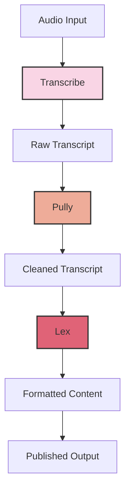

# Transcribe, Polly, Lex

Transcribe is used to convert videos and images to text.&#x20;

Lex: is the chatbots.

Polly: turns text into lifelike speech using a variety of languages and accents.

## Alexa example

Person -> Amazon Translate -> Lex -> Polly -> Perosn&#x20;

