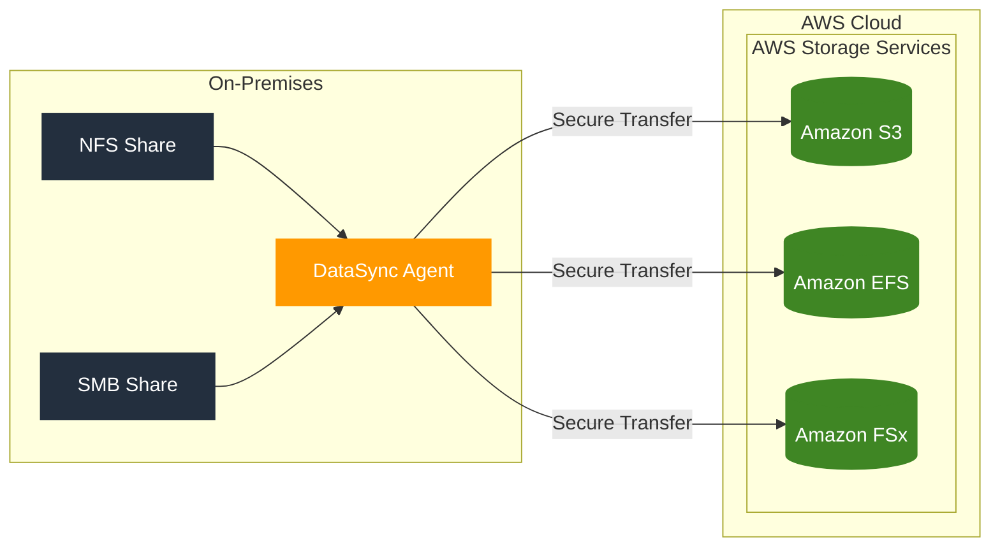

# DataSync

## AWS DataSync

A managed data transfer service designed for large-scale data migration between on-premises storage and AWS.

### Key Features

* Agent-based solution
* Optimized for one-time large data migrations
* Supports automated data transfer

### Supported Source Protocols

* Network File System (NFS)
* Server Message Block (SMB)

### Supported AWS Destinations

* Amazon S3 (Simple Storage Service)
* Amazon EFS (Elastic File System)
* Amazon FSx

### Primary Use Case

Ideal for:

* One-time migration of large datasets
* Initial data transfer to AWS storage services
* Bulk data movement to cloud storage

