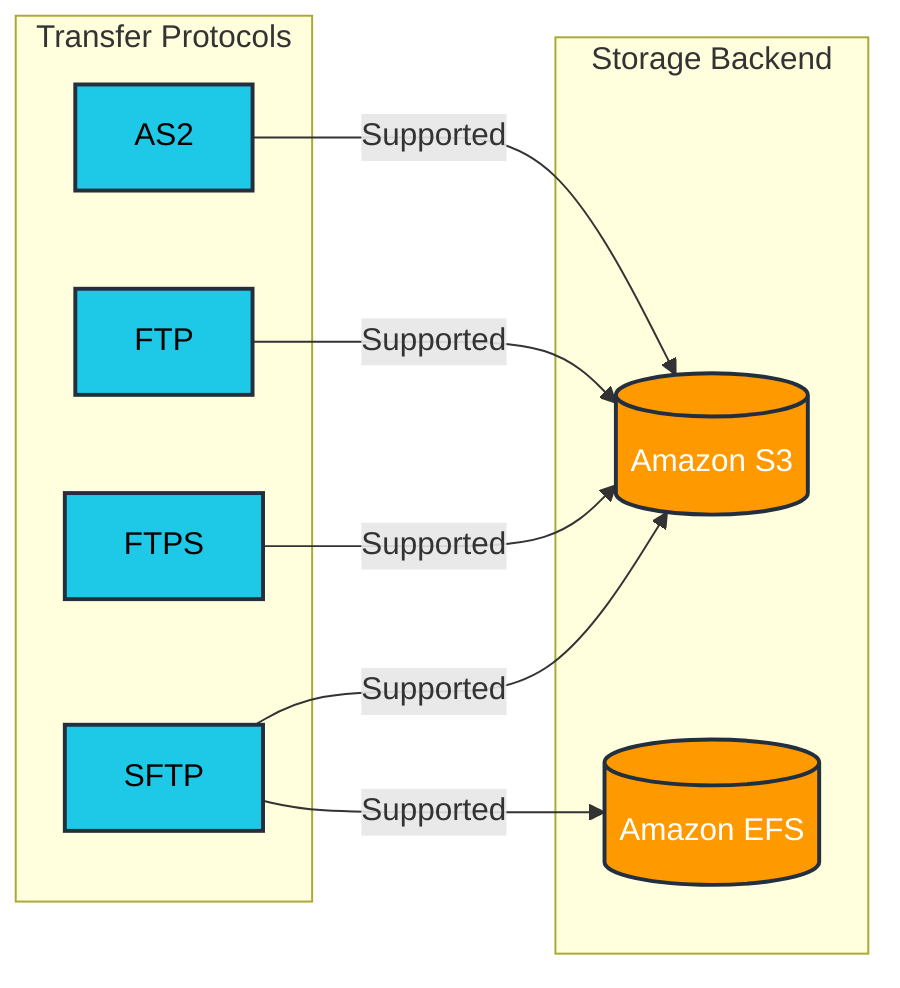

# Transfer family

## AWS Transfer Family

A service that enables file transfers into and out of AWS storage services using standard transfer protocols. It allows applications (e.g. legacy applications) to read and write from S3 or EFS.

### Supported Protocols

* SFTP (Secure File Transfer Protocol)
* FTPS (File Transfer Protocol over SSL)
* FTP (File Transfer Protocol)

### Supported AWS Storage Services

* Amazon S3 (Simple Storage Service)
* Amazon EFS (Elastic File System)

### Key Benefit

* Enables cloud migration of legacy systems without modifying existing workflows
* Maintains compatibility with legacy applications while leveraging cloud storage benefits
* Bridges traditional file transfer methods with modern cloud storage

