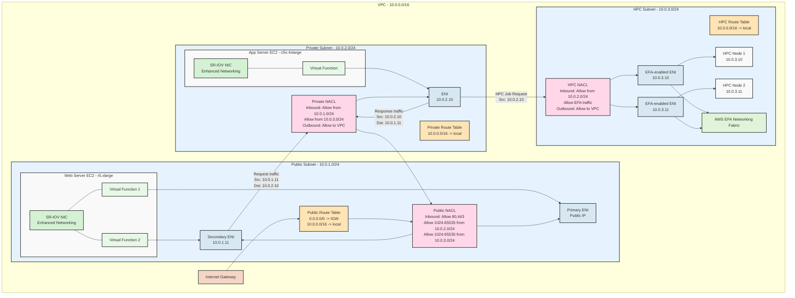

# Networking

There are two types of VPC Endpoints:

* Interface Endpoint (ENI)&#x20;
* Gateway Endpoing (used for S3 and Dyname DB)&#x20;

<figure><figcaption></figcaption></figure>

There are three types of Network Interface Types in AWS:

1. Elastic Network Interface (**ENI**):

* Basic networking interface that serves as a virtual network card
* Real-world example: A financial services company running both customer-facing applications and internal audit systems on the same EC2 instance
  * Primary ENI handles customer transactions on the production network
  * Secondary ENI connects to a separate, isolated network for audit logging and compliance monitoring
  * This separation ensures audit logs cannot be tampered with via the production network
* Another example: Multi-homed web application
  * Primary ENI for public internet traffic
  * Secondary ENI connected to internal services like databases
  * Enables security through network segregation without need for additional instances

2. Elastic Fabric Adapter (**EFA**):

* Specialized network interface for high-performance computing (HPC) workloads
* Real-world example: Pharmaceutical company running molecular dynamics simulations
  * Uses EFA-enabled instances in a cluster to simulate protein folding
  * Achieves near-bare-metal performance with OS-bypass capability
  * Reduces simulation time from days to hours
* Another example: Financial risk analysis
  * Investment bank running Monte Carlo simulations across a cluster
  * EFA enables low-latency communication between nodes
  * Processes millions of scenarios in real-time for risk calculations

3. **Enhanced Networking**:

* High-performance networking using SR-IOV (Single Root I/O Virtualization)
* Real-world example: Video streaming service
  * Uses enhanced networking with throughput between 10 Gbps and 100 Gbps
  * Handles thousands of concurrent video streams
  * Provides consistent low-latency delivery to end users
* Another example: Real-time gaming platform
  * Leverages enhanced networking for reliable, high-throughput game server instances
  * Supports thousands of concurrent players with minimal latency
  * Uses either Intel 82599 VF or Elastic Network Adapter (ENA) depending on instance type

Key Differences and When to Use Each:

* Use ENI when you need network segregation or multiple networks at minimal cost
* Choose EFA when you need HPC-level performance and OS-bypass capabilities
* Implement Enhanced Networking when you need reliable high bandwidth but don't require the specialized capabilities of EFA

Note that Enhanced Networking is automatically enabled on most modern EC2 instance types, while ENI and EFA require specific configuration and are used for specialized use cases.

| Feature                  | Elastic Network Interface (ENI)                     | Elastic Fabric Adapter (EFA)                      | Enhanced Networking                                    |
| ------------------------ | --------------------------------------------------- | ------------------------------------------------- | ------------------------------------------------------ |
| Primary Purpose          | Network connectivity for EC2 instances              | High Performance Computing (HPC) and ML workloads | Improved network performance                           |
| Performance              | Standard EC2 networking performance                 | Ultra-high performance, low latency               | High performance, low latency                          |
| Max Bandwidth            | Varies by instance type                             | Up to 100 Gbps                                    | Up to 100 Gbps (with ENA)                              |
| Latency                  | Standard                                            | Ultra-low                                         | Low                                                    |
| OS-bypass                | No                                                  | Yes                                               | No                                                     |
| Multiple IP Addresses    | Yes                                                 | No (uses single ENI)                              | No (feature of underlying ENI)                         |
| Attached to Instance     | Can be attached/detached                            | Permanent for instance lifetime                   | Built into instance networking                         |
| MPI Support              | No                                                  | Yes                                               | No                                                     |
| RDMA Support             | No                                                  | Yes                                               | No                                                     |
| Use Cases                | Network segmentation, multiple IPs, security groups | HPC, large-scale parallel processing, ML          | General high-performance networking needs              |
| Instance Type Support    | All EC2 instance types                              | Select HPC-optimized instances                    | Most current generation instances                      |
| Implementation           | Virtual network interface                           | Custom network interface                          | SR-IOV (ENA or Intel 82599 VF)                         |
| Additional Configuration | Manual attachment and IP configuration              | Requires specific enablement                      | Often enabled by default, may need driver installation |

AWS Network Adapters:

| Feature                  | Elastic Network Adapter (ENA)               | Intel 82599 VF                                 | Elastic Fabric Adapter (EFA)                         |
| ------------------------ | ------------------------------------------- | ---------------------------------------------- | ---------------------------------------------------- |
| Primary Use              | Enhanced Networking                         | Enhanced Networking                            | High Performance Computing (HPC)                     |
| Max Bandwidth            | Up to 100 Gbps                              | Up to 10 Gbps                                  | Up to 100 Gbps                                       |
| Latency                  | Low                                         | Low                                            | Ultra-low                                            |
| OS-bypass                | No                                          | No                                             | Yes                                                  |
| Supported Instance Types | Most current generation                     | Older generation (C3, C4, R3, I2, M4)          | Select HPC-optimized instances                       |
| MPI Support              | No                                          | No                                             | Yes                                                  |
| RDMA Support             | No                                          | No                                             | Yes                                                  |
| Libfabric Support        | No                                          | No                                             | Yes                                                  |
| Best For                 | General purpose high performance networking | Legacy instances requiring enhanced networking | HPC and ML applications requiring the lowest latency |
| Implementation           | SR-IOV                                      | SR-IOV                                         | Custom                                               |
| Default on New Instances | Yes (for supported types)                   | No                                             | No (requires specific enablement)                    |
