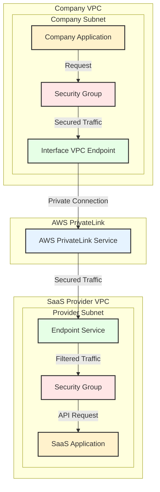

# AWS PrivateLink Implementation Guide for Third-Party SaaS Integration

### Overview

This document provides implementation steps for establishing secure, private connectivity between a company VPC and a third-party SaaS application using AWS PrivateLink. This solution ensures private API access without internet exposure while maintaining security best practices.




### Prerequisites

* AWS account with administrative access
* Existing VPC where company resources are deployed
* Third-party SaaS provider's AWS account ID
* Service name provided by the SaaS provider
* List of required API endpoints and their ports
* AWS CLI configured with appropriate credentials

### Architecture Components

1. Interface VPC Endpoint (Consumer Side)
2. Endpoint Service (Provider Side)
3. Security Groups
4. DNS Settings
5. IAM Permissions

### Implementation Steps

#### 1. Pre-Implementation Checklist

* [ ] Confirm VPC CIDR ranges don't overlap
* [ ] Verify available IP addresses in subnets
* [ ] Document required API endpoints and ports
* [ ] Obtain service name from SaaS provider
* [ ] Verify AWS region compatibility

#### 2. Security Group Configuration

```bash
# Create security group for the VPC endpoint
aws ec2 create-security-group \
    --group-name "privatelink-endpoint-sg" \
    --description "Security group for PrivateLink endpoint" \
    --vpc-id "vpc-xxxxx"

# Add inbound rules for specific API ports
aws ec2 authorize-security-group-ingress \
    --group-id "sg-xxxxx" \
    --protocol tcp \
    --port 443 \
    --cidr YOUR_VPC_CIDR
```

#### 3. Create Interface VPC Endpoint

```bash
# Create the interface endpoint
aws ec2 create-vpc-endpoint \
    --vpc-id vpc-xxxxx \
    --vpc-endpoint-type Interface \
    --service-name com.amazonaws.vpce.region.vpce-svc-xxxxx \
    --subnet-ids subnet-xxxxx subnet-yyyyy \
    --security-group-ids sg-xxxxx \
    --private-dns-enabled true
```

#### 4. DNS Configuration

1. Verify private DNS settings are enabled
2. Update application configurations to use the endpoint DNS names

#### 5. IAM Policy Configuration

```json
{
    "Version": "2012-10-17",
    "Statement": [
        {
            "Sid": "AccessToPrivateLink",
            "Effect": "Allow",
            "Action": [
                "ec2:DescribeVpcEndpoints",
                "ec2:CreateVpcEndpoint",
                "ec2:DeleteVpcEndpoints",
                "ec2:ModifyVpcEndpoint"
            ],
            "Resource": "*",
            "Condition": {
                "StringEquals": {
                    "aws:RequestedRegion": ["your-region"]
                }
            }
        }
    ]
}
```

#### 6. Testing and Validation

1. Test API Connectivity:

```bash
# Test endpoint DNS resolution
nslookup api.saasprovider.com

# Test API connectivity
curl -X GET https://api.saasprovider.com/health \
    -H "Authorization: Bearer YOUR_TOKEN"
```

2. Validation Checklist:

* [ ] DNS resolution works correctly
* [ ] API calls succeed through the endpoint
* [ ] Security group logs show expected traffic
* [ ] No traffic routes through internet
* [ ] Monitoring metrics show endpoint usage

### Monitoring and Maintenance

#### CloudWatch Metrics to Monitor

* EndpointConnectionEstablished
* EndpointConnectionError
* BytesProcessed
* ConnectionAttemptCount
* ConnectionEstablishedCount

#### CloudWatch Alarms Configuration

```bash
# Create alarm for endpoint errors
aws cloudwatch put-metric-alarm \
    --alarm-name "privatelink-endpoint-errors" \
    --alarm-description "Alert on PrivateLink endpoint errors" \
    --metric-name "EndpointConnectionError" \
    --namespace "AWS/PrivateLink" \
    --statistic "Sum" \
    --period 300 \
    --threshold 1 \
    --comparison-operator GreaterThanThreshold \
    --evaluation-periods 1 \
    --alarm-actions "arn:aws:sns:region:account-id:topic-name"
```

### Security Best Practices

1. Endpoint Security:
   * Regularly review and update security group rules
   * Implement endpoint policies for fine-grained access control
   * Enable VPC flow logs for endpoint traffic monitoring
2. Access Management:
   * Use IAM roles instead of access keys
   * Implement least privilege access
   * Regularly rotate credentials
   * Monitor and audit endpoint usage
3. Network Security:
   * Implement network segmentation
   * Use security groups for granular access control
   * Enable VPC flow logs
   * Regular security assessments

### Troubleshooting Guide

#### Common Issues and Solutions

1. Connection Issues:
   * Verify security group configurations
   * Check DNS resolution
   * Validate IAM permissions
   * Review VPC endpoint status
2. Performance Issues:
   * Monitor endpoint metrics
   * Check for throttling
   * Verify subnet routing
   * Review application timeouts
3. DNS Resolution Problems:
   * Verify private DNS settings
   * Check DHCP options set
   * Validate Route 53 resolver settings

### Maintenance Tasks

#### Regular Maintenance Checklist

* [ ] Review security group rules monthly
* [ ] Audit IAM permissions quarterly
* [ ] Update endpoint configurations as needed
* [ ] Monitor and optimize costs
* [ ] Review and update documentation

#### Backup and Disaster Recovery

1. Document endpoint configurations
2. Maintain restoration procedures
3. Regular testing of failover scenarios
4. Cross-region considerations

### Cost Considerations

* Endpoint hourly charges
* Data processing fees
* Data transfer costs
* Additional VPC charges

### Documentation and Compliance

#### Required Documentation

1. Network architecture diagrams
2. Security configurations
3. Compliance attestations
4. Operational procedures
5. Emergency contact information

#### Compliance Checklist

* [ ] Data classification requirements
* [ ] Access control documentation
* [ ] Security assessment reports
* [ ] Audit logs retention
* [ ] Incident response procedures
