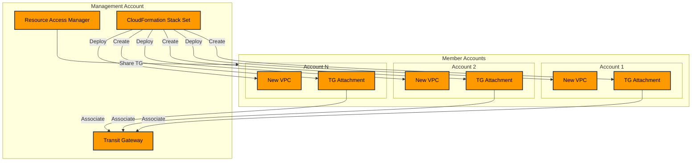

# AWS Transit Gateway Multi-Account Implementation Guide

### Overview

This document provides step-by-step instructions for implementing a centralized Transit Gateway solution across multiple AWS accounts using AWS Organizations. The solution automates the creation of VPCs and Transit Gateway attachments in member accounts using CloudFormation Stack Sets.




### Prerequisites

* AWS Organizations set up with a management account
* Minimum of one member account
* Administrative access to the management account
* Service-managed permissions enabled in Organizations

### Implementation Steps

#### 1. Create Transit Gateway in Management Account

```yaml
# transit-gateway.yaml
Resources:
  TransitGateway:
    Type: AWS::EC2::TransitGateway
    Properties:
      AmazonSideAsn: 64512
      AutoAcceptSharedAttachments: enable
      DefaultRouteTableAssociation: enable
      DefaultRouteTablePropagation: enable
      Description: Central Transit Gateway for cross-account networking
      Tags:
        - Key: Name
          Value: Central-TGW
```

#### 2. Configure Resource Access Manager (RAM)

1. Enable resource sharing:

```bash
aws ram enable-sharing-with-aws-organizations
```

2. Create RAM share for Transit Gateway:

```yaml
# ram-share.yaml
Resources:
  TransitGatewayShare:
    Type: AWS::RAM::ResourceShare
    Properties:
      Name: TGW-Share
      Principals: 
        - '*'  # Shares with all accounts in organization
      ResourceArns: 
        - !Ref TransitGateway
```

#### 3. Create CloudFormation Stack Set

```yaml
# member-vpc-tgw.yaml
Parameters:
  TransitGatewayId:
    Type: String
    Description: ID of the shared Transit Gateway
  
Resources:
  VPC:
    Type: AWS::EC2::VPC
    Properties:
      CidrBlock: !Sub 10.${AWS::AccountId}.0.0/16
      EnableDnsHostnames: true
      EnableDnsSupport: true
      Tags:
        - Key: Name
          Value: !Sub ${AWS::AccountId}-VPC

  TransitGatewayAttachment:
    Type: AWS::EC2::TransitGatewayAttachment
    Properties:
      TransitGatewayId: !Ref TransitGatewayId
      VpcId: !Ref VPC
      SubnetIds: 
        - !Ref PublicSubnet1
        - !Ref PublicSubnet2
      Tags:
        - Key: Name
          Value: !Sub ${AWS::AccountId}-TGW-Attachment

  # Subnet definitions and route table configurations omitted for brevity
  # Include necessary subnet and routing configurations in actual implementation
```

#### 4. Deploy Stack Set

1. Create Stack Set:

```bash
aws cloudformation create-stack-set \
  --stack-set-name member-vpc-tgw \
  --template-body file://member-vpc-tgw.yaml \
  --parameters ParameterKey=TransitGatewayId,ParameterValue=tgw-xxxxxxxxxxxx \
  --permission-model SERVICE_MANAGED \
  --auto-deployment Enabled=true,RetainStacksOnAccountRemoval=false
```

2. Create Stack Instances:

```bash
aws cloudformation create-stack-instances \
  --stack-set-name member-vpc-tgw \
  --regions us-east-1 \
  --deployment-targets OrganizationalUnitIds='["ou-xxxx-xxxxxxxx"]'
```

### Validation Steps

1. Verify Transit Gateway Attachments:

```bash
aws ec2 describe-transit-gateway-attachments \
  --filters Name=transit-gateway-id,Values=tgw-xxxxxxxxxxxx
```

2. Check VPC Creation:

```bash
aws ec2 describe-vpcs \
  --filters "Name=tag:Name,Values=*-VPC"
```

### Monitoring and Maintenance

#### CloudWatch Metrics to Monitor

* TransitGatewayAttachment status
* VPC creation status
* Stack Set deployment status

#### Regular Maintenance Tasks

1. Review and update route tables
2. Monitor attachment status
3. Verify proper resource sharing
4. Check CloudFormation stack status

### Security Considerations

1. Network Security
   * Implement appropriate NACLs and Security Groups
   * Enable VPC Flow Logs
   * Configure proper route table entries
2. Access Control
   * Use IAM roles with least privilege
   * Implement resource-based policies
   * Regular audit of RAM shares
3. Compliance
   * Enable AWS Config
   * Implement appropriate tags
   * Monitor CloudTrail logs

### Troubleshooting

#### Common Issues and Solutions

1. Stack Set Deployment Failures
   * Verify service-managed permissions
   * Check IAM roles and permissions
   * Review CloudFormation logs
2. Transit Gateway Attachment Issues
   * Verify RAM sharing status
   * Check subnet configurations
   * Review route table entries
3. Networking Problems
   * Validate route propagation
   * Check CIDR overlap
   * Verify security group rules

### Cost Considerations

1. Transit Gateway Costs
   * Attachment hours
   * Data processing charges
   * Cross-AZ traffic
2. CloudFormation Costs
   * Stack operations
   * API calls

### Best Practices

1. Naming Conventions
   * Use consistent naming patterns
   * Include account IDs in resource names
   * Tag all resources appropriately
2. Network Design
   * Plan CIDR ranges carefully
   * Consider future growth
   * Document routing policies
3. Automation
   * Use Infrastructure as Code
   * Implement proper error handling
   * Regular testing of automation

### Appendix

#### Useful Commands

```bash
# Check Transit Gateway status
aws ec2 describe-transit-gateways

# List RAM shares
aws ram get-resource-shares

# Update Stack Set
aws cloudformation update-stack-set

# List Stack Set operations
aws cloudformation list-stack-set-operations
```

#### Reference Architecture Diagram

\[Include the architecture diagram created earlier]

#### Template Modifications

Document any customizations needed for specific use cases or requirements.

### Version History

| Version | Date       | Author     | Changes          |
| ------- | ---------- | ---------- | ---------------- |
| 1.0     | 2025-01-11 | Cloud Team | Initial document |

***

End of Implementation Guide
