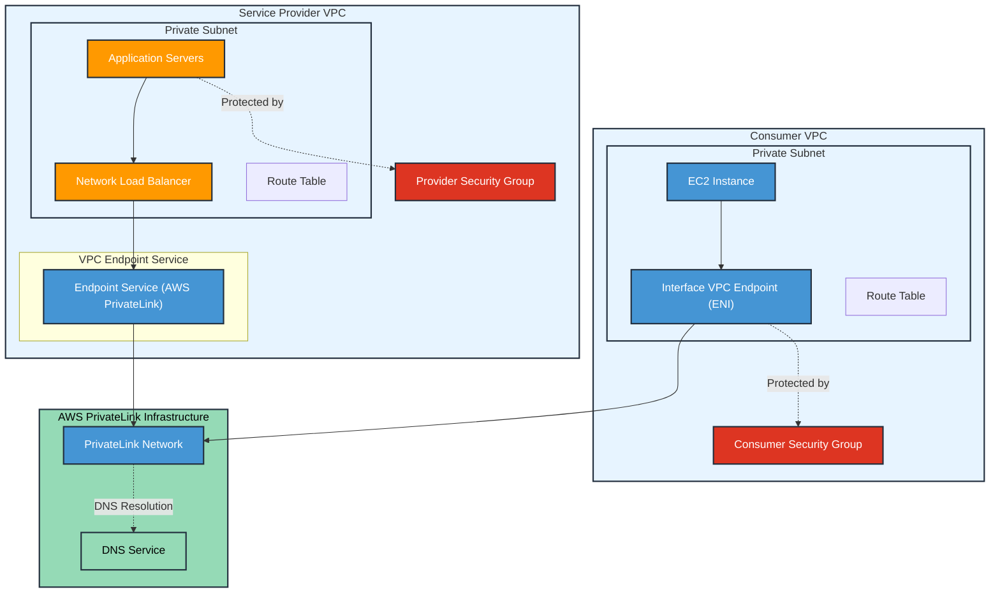

# PrivateLink SAAS Use case

AWS PrivateLink is specifically designed for this SaaS provider use case. It allows you to expose a service to thousands of VPCs (both your own and other accounts) without requiring VPC peering, VPN, or Direct Connect.

The best way to expose a service VPC to tens, hundreds, or thousands of customer VPCs.

Key points from AWS docs:

1. Service providers can create an endpoint service using a Network Load Balancer
2. Consumers can create an **Interface VPC endpoints** to connect to the service
3. Traffic stays on the AWS network and doesn't traverse the internet
4. Minimal administrative overhead - no need to manage VPC peering, VPN, or Direct Connect connections
5. Scales to thousands of consumers

The service provider must associate their endpoint service with either:

* Network Load Balancer (NLB)
* Gateway Load Balancer (GWLB)

This load balancer sits in front of their application/service.

The service consumer can create **VPC endpoints** to connect to the service:

* Consumers create Interface VPC Endpoints in their VPC
* These endpoints appear as Elastic Network Interfaces (ENIs) with private IP addresses
* They must be created in specified subnets within the consumer's VPC

Requires a **Network Load Balancer** on the provider VPC and an **ENI** on the customer VPC.

