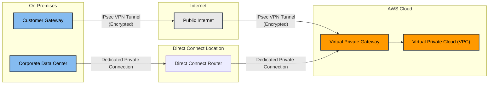
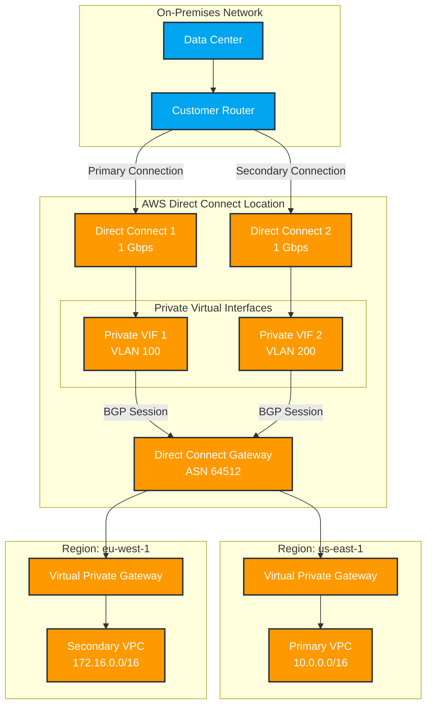

# Direct Connect

AWS Direct Connect is a dedicated network connection service that creates a private, high-bandwidth link between your on-premises infrastructure and AWS. Think of it as a private highway between your data center and Amazon's cloud, bypassing the public internet.

* The connection if private.
* Compared to internet based connections, it reduce network costs, increase bandwidth throughput, and provide more consistent network experience.

There are two types of Direct Connect Connection:

* **Dedicated Connection**: A Physical Ethernet connection associated with a dedicated connection through the AWS Direct Connect console, the CLI, or the API.
* **Hosted Connection**: A physical Ethernet connection that an AWS Direct Connect Partner provision on behalf of a customer.&#x20;

<figure><figcaption></figcaption></figure>

Key benefits include:

1. Performance

* Consistent, predictable network performance
* Lower latency compared to internet-based connections
* Higher bandwidth options (1Gbps, 10Gbps, 100Gbps, 400Gbps)

2. Security

* Private connection that doesn't traverse the public internet
* Data travels through dedicated fibre optic lines
* Compatible with all AWS security features

3. Cost Savings

* Reduced data transfer costs compared to internet-based transfer
* More predictable network costs
* Better economics for high-volume data transfer

4. Connection Options

* Dedicated Connection: Direct 1Gbps or 10Gbps connection
* Hosted Connection: Smaller capacities through AWS partners
* LAG (Link Aggregation Groups): Multiple connections bundled together

Common use cases:

* Hybrid cloud architectures
* Large-scale data migration
* Real-time data processing
* Disaster recovery
* Business-critical applications requiring consistent performance

### AWS Direct Connect's availability

AWS Direct Connect's availability depends on how you configure your connections. Here's a breakdown:

1. Single Connection (99.9% availability):

* One Direct Connect connection
* One customer router
* One AWS Direct Connect location
* Vulnerable to single points of failure

2. Active/Active Configuration (99.99% availability):

* Two or more Direct Connect connections
* Multiple customer routers
* Different AWS Direct Connect locations
* Both connections actively used
* Traffic distributed across connections using BGP
* Automatic failover if one connection fails

3. Active/Standby Configuration:

* Similar to Active/Active but with one primary and one backup connection
* Secondary connection only used if primary fails
* Slightly higher latency during failover compared to Active/Active

Best Practices for High Availability:

1. Use multiple Direct Connect locations
2. Set up connections from different service providers
3. Implement redundant customer routers
4. Configure BGP routing for automatic failover
5. Consider using Direct Connect Gateway for multi-region connectivity

AWS recommends implementing redundant Direct Connect connections through different Direct Connect locations for business-critical applications to achieve the highest availability.

Additionally, you can maintain a backup VPN connection as a last resort failover option, though this would route through the public internet and have different performance characteristics.

## VPNs vs Direct Connect

VPNs allow private communication, but it still traverses the public internet to get the data delivered. While secure, it can be slow.

Direct Connect is:

* Fast
* Secure
* Reliable
* Able to take massive throughput
