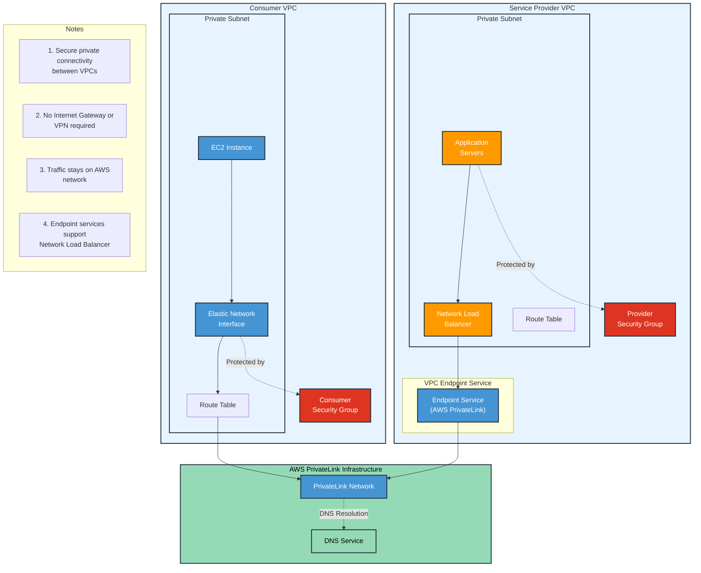

# PrivateLink

AWS PrivateLink is specifically designed for this SaaS provider use case. It allows you to expose a service to thousands of VPCs (both your own and other accounts) without requiring VPC peering, VPN, or Direct Connect.

Key points from AWS docs:

1. Service providers can create an endpoint service using a Network Load Balancer
2. Consumers can create VPC endpoints to connect to the service
3. Traffic stays on the AWS network and doesn't traverse the internet
4. Minimal administrative overhead - no need to manage VPC peering, VPN, or Direct Connect connections
5. Scales to thousands of consumers

* The best way to expose a service VPC to tens, hundreds, or thousands of customer VPCs&#x20;
* Doesn't require VPC peering; no route tables, NAT gateways, internet gateways, etc.
* Requires a **Network Load Balancer** on the service VPC and an **ENI** on the customer VPC.

<figure><figcaption></figcaption></figure>

### What is the difference between Interface Endpoint and Elastic Network Interface?

Let me explain the key differences between Interface Endpoints and Elastic Network Interfaces (ENIs) in AWS:

Interface Endpoints:

* These are VPC endpoints that enable you to privately connect your VPC to supported AWS services (like S3, DynamoDB, etc.)
* They are powered by AWS PrivateLink
* Create a private entry point within your VPC that AWS services can be accessed through
* Have their own DNS entries and security groups
* Main purpose is to keep traffic between your VPC and AWS services within the AWS network, avoiding the public internet

Elastic Network Interfaces (ENIs):

* These are virtual network cards that you can attach to EC2 instances
* More general-purpose networking component that provides network connectivity to AWS resources
* Can have multiple private IP addresses, public IP addresses, and security groups
* Can be moved between instances (useful for failover scenarios)
* Main purpose is to provide network connectivity for EC2 instances and other AWS resources

Key distinction: Interface Endpoints are specifically for connecting to AWS services privately, while ENIs are general-purpose network interfaces for AWS resources. In fact, Interface Endpoints actually use ENIs under the hood to provide their functionality.
