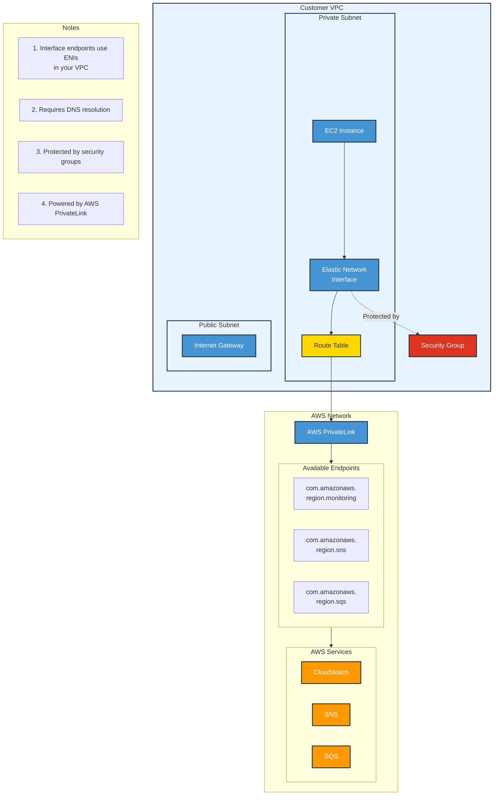
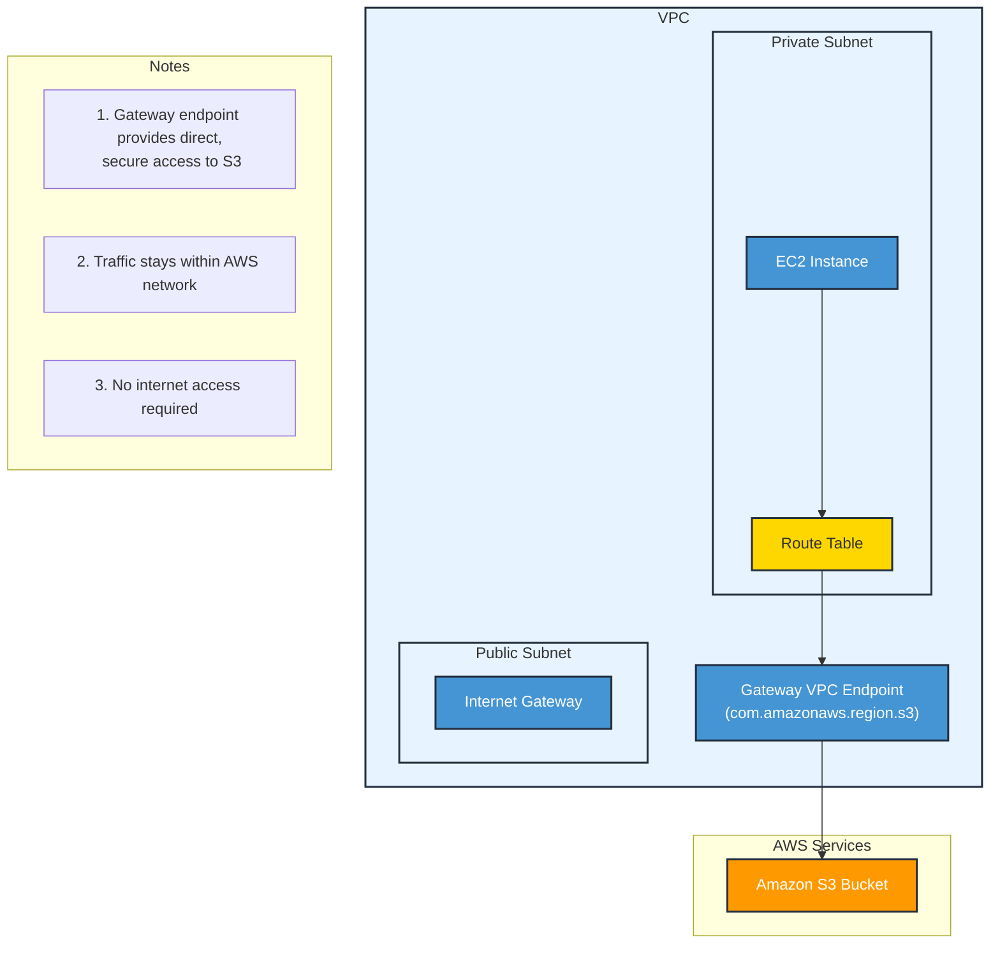

# VPC Endpoint

VPC Endpoints are virtual devices horizontally scalable, redudant, and highly available VPC components that allow communication between instances in your VPC and services without imposing availability risks or bandwidth constraints on your network traffic.

A VPC endpoint enables to privately connect VPC to  supported AWS services and VPC endpoints services powered by PriviateLink without requiring an internet gateway, NAT device, VPN connect, or AWS Direct Connect connection.&#x20;

**Traffic between a VPC and other services do not leave the Amazon Network**. Instances in the VPC do not require public IP addresses to communicate with resources in the service.

As opposite to a NAT Gateway that has a limit on the bandwidth. For example if we have got and EC2 instance ghat is connecting to an S3 service we want to use a VPN endpoint and not a NAT Gateway.

There are 2 types of endpoints:

1. Interface endpoints
2. Gateway endpoints

### Interface endpoints

These are **elastic network interface with a private IP address** that server as entry point for traffic haded to a supported service. They support a large number of AWS services.

Key Features (shown in notes):

* Interface endpoints are implemented using ENIs in your VPC
* Requires DNS resolution to work
* Protected by security groups
* Powered by AWS PrivateLink technology

Main differences from Gateway endpoints:

1. Uses ENIs instead of gateway targets
2. Requires security groups
3. Can be used with more AWS services
4. Requires DNS resolution

### Gateway endpoints

Similar to NAT gateway, these are **virtual device we provision**. It supports connection to S3 and DynameDB.

## Connection a EC2 intance, in a private subnet, to S3 Service

1. Go to the EC2 instance
2. In action/security/Modify IAM role, attach the S3\_Admin\_Access role to the instance
3. Go to VPC/Endpoints
4. create a new endpoints:
   1. In Services section select S3&#x20;
   2. select Gateway&#x20;
   3. select the VPC&#x20;
   4. select the route table where we want to deploy the endpoint into.
5. from the EC2 instance terminal try to run: aws s3 ls
