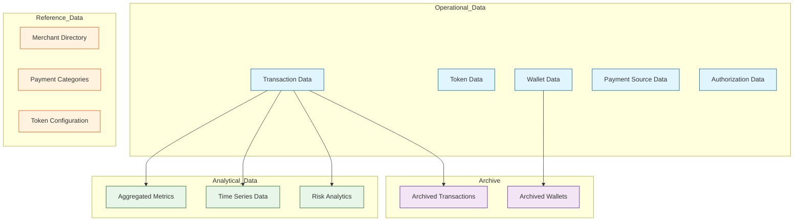

# Data

The following section design a comprehensive data architecture for an enterprise payment system handling digital payment tokens and mobile payments.




Let me explain the key components and how to structure them:

1. Operational Data (Hot Storage)
   * Transaction Data:
     * Core fields: transaction\_id, amount, currency, timestamp, status
     * Payment method details (Google Pay/Apple Pay tokens)
     * Should be highly available and quickly accessible
     * Retention: Live system 90-180 days
   * Token Data:
     * Tokenized payment credentials
     * Token metadata (expiry, token provider)
     * Requires encryption at rest
     * Retention: As long as token is active
   * Wallet Data:
     * User payment preferences
     * Linked payment methods
     * Token-to-card mappings
     * Retention: Account lifetime + 30 days
2. Analytical Data (Warm Storage)
   * Aggregated metrics:
     * Daily/weekly/monthly transaction volumes
     * Success rates by payment method
     * Average transaction values
     * Retention: 3-5 years
   * Time series data:
     * Transaction patterns
     * Usage trends
     * Performance metrics
     * Retention: 1-2 years
3. Reference Data
   * Payment method configurations
   * Fee structures
   * Merchant categories
   * Retention: Keep historical versions
4. Archive Data (Cold Storage)
   * Completed transactions
   * Inactive tokens
   * Closed accounts
   * Retention: 7-10 years (based on regulatory requirements)

For data documentation and lineage:

1. Data Dictionary:

```markdown
- Each data element should have:
  - Technical name
  - Business description
  - Data type and format
  - Source system
  - Security classification
  - Retention period
  - Regulatory requirements
```

2. Data Lineage Tracking:
   * Use tools like Collibra or Apache Atlas
   * Track:
     * Data source origins
     * Transformation steps
     * Dependencies
     * Usage patterns
     * Access history
3. Metadata Management:
   * Version control for schema changes
   * Data quality metrics
   * Access controls and audit logs
   * Business context and ownership

Best Practices:

1. Data Classification:
   * PCI data (highly sensitive)
   * Personal data (GDPR/CCPA scope)
   * Business data (internal use)
   * Public data
2. Storage Considerations:
   * Hot data: High-performance databases (PostgreSQL, MongoDB)
   * Warm data: Data warehouses (Snowflake, BigQuery)
   * Cold data: Object storage (S3, Google Cloud Storage)
3. Security Requirements:
   * Encryption at rest and in transit
   * Tokenization for sensitive data
   * Access control and audit logging
   * Data masking for non-production environments

Would you like me to elaborate on any of these aspects or provide more specific details about a particular component?
