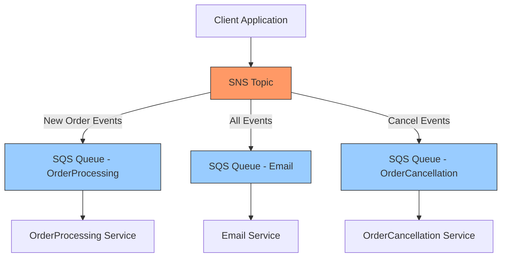

# Marketplace Application

A company wants to build an online marketplace application on AWS as a set of loosely coupled microservices. For this application, when a customer submits a new order, two microservices should handle the event simultaneously. The Email microservice will send a confirmation email, and the OrderProcessing microservice will start the order delivery process. If a customer cancels an order, the OrderCancellation and Email microservices should handle the event simultaneously. A solutions architect wants to use Amazon Simple Queue Service (Amazon SQS) and Amazon Simple Notification Service (Amazon SNS) to design the messaging between the microservices. How should the solutions architect design the solution?

Create an SNS topic with SQS queues subscribed using message filtering.

Why this works best:

* SNS enables simultaneous message delivery to multiple subscribers (fan-out)
* SQS queues ensure reliable message processing for each microservice
* Message filtering lets each queue receive only relevant events


```json
// SNS Filter Policy for OrderProcessing Queue
{
  "filter-policy": {
    "type": ["com.marketplace.order.created"]
  }
}

// SNS Filter Policy for OrderCancellation Queue
{
  "filter-policy": {
    "type": ["com.marketplace.order.cancelled"]
  }
}

// SNS Filter Policy for Email Queue
{
  "filter-policy": {
    "type": [
      "com.marketplace.order.created",
      "com.marketplace.order.cancelled"
    ]
  }
}

// Example message format
{
  "specversion": "1.0",
  "type": "com.marketplace.order.created",
  "source": "/marketplace/orders",
  "id": "order-123-456",
  "time": "2024-03-10T10:30:00Z",
  "datacontenttype": "application/json",
  "data": {
    "orderId": "123456",
    "customerId": "789",
    "items": ["item1", "item2"],
    "total": 99.99
  }
}
```

The binding happens during queue subscription to the SNS topic. Here's how:

Using AWS Console:

1. Go to SQS Queue -> Subscribe to SNS topic
2. Add subscription filter policy in JSON format

Using AWS CLI:

```bash
aws sns subscribe \
  --topic-arn arn:aws:sns:region:account-id:topic-name \
  --protocol sqs \
  --notification-endpoint arn:aws:sqs:region:account-id:queue-name \
  --attributes '{"FilterPolicy":"{\"type\":[\"com.marketplace.order.created\"]}"}'
```

Using AWS CDK:

```typescript
const queue = new sqs.Queue(this, 'OrderProcessingQueue');
const topic = new sns.Topic(this, 'OrdersTopic');

topic.addSubscription(new subs.SqsSubscription(queue, {
  filterPolicy: {
    type: sns.SubscriptionFilter.stringFilter({
      allowlist: ['com.marketplace.order.created']
    })
  }
}));
```

* Loose coupling maintained between services





Architecture:

1. SNS topic receives all order events
2. Three SQS queues subscribe with filters:
   * Email queue: receives all events
   * OrderProcessing: new orders only
   * OrderCancellation: cancellations only


