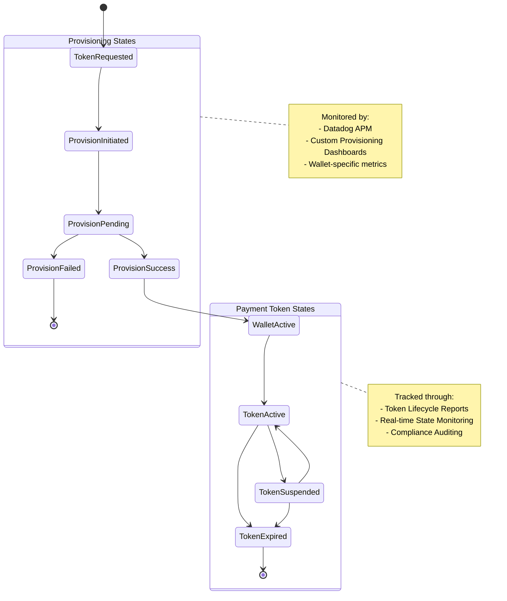

# Reporting System 2

I'll update the architecture to include the wallet services and differentiate between provisioning and payment token states. I'll create two diagrams: one for the overall architecture and another focused on the state management and reporting.

```mermaid

flowchart TB
    subgraph WalletServices["Wallet Services Layer"]
        Wallet1["Wallet Service 1\n(e.g., Apple Pay)"]
        Wallet2["Wallet Service 2\n(e.g., Google Pay)"]
        Wallet3["Wallet Service 3\n(e.g., Samsung Pay)"]
        Wallet4["Wallet Service 4\n(e.g., Custom Wallet)"]
    end

    subgraph TokenCore["Token Core Services"]
        direction LR
        ProvisionService["Provisioning Service"]
        TokenService["Token Service"]
        StateManager["State Management Service"]
    end

    subgraph Data_Sources["Data Sources"]
        APIGateway["API Gateway"]
        Lambda["Lambda Functions"]
        RDS["PostgreSQL RDS"]
    end

    subgraph Data_Collection["Data Collection Layer"]
        DatadogAgent["Datadog Agent"]
        Kinesis["Kinesis Streams"]
        S3["S3 Data Lake"]
    end

    subgraph Storage["Data Storage Layer"]
        direction LR
        Snowflake["Snowflake DW"]
        DatadogMetrics["Datadog Metrics Store"]
        PostgreSQL["PostgreSQL\n- Provision States\n- Payment States"]
    end

    subgraph Reporting["Reporting Systems"]
        direction TB
        subgraph RealTime["Real-Time Monitoring"]
            direction LR
            DatadogDash["Datadog Dashboards\n- Wallet Performance\n- Token States\n- Provision States"]
            DatadogAPM["Datadog APM"]
            DatadogAlerts["Datadog Alerts"]
        end

        subgraph BI["Business Intelligence"]
            direction LR
            Tableau["Tableau Reports\n- Wallet Analytics\n- Token Usage\n- Provision Success"]
            CustomAPI["Custom API Reports"]
        end

        subgraph Compliance["Compliance & Audit"]
            direction LR
            AuditReports["Audit Reports"]
            ComplianceDash["Compliance Dashboards"]
        end
    end

    %% Wallet Service Connections
    Wallet1 & Wallet2 & Wallet3 & Wallet4 --> ProvisionService
    Wallet1 & Wallet2 & Wallet3 & Wallet4 --> TokenService

    %% Core Service Connections
    ProvisionService --> StateManager
    TokenService --> StateManager
    StateManager --> RDS

    %% Data Source Connections
    TokenCore --> DatadogAgent
    APIGateway --> DatadogAgent
    Lambda --> DatadogAgent
    RDS --> DatadogAgent
    WalletServices --> Kinesis
    APIGateway --> S3

    %% Storage to Reporting
    DatadogMetrics --> DatadogDash
    DatadogMetrics --> DatadogAPM
    DatadogMetrics --> DatadogAlerts
    
    Snowflake --> Tableau
    Snowflake --> CustomAPI
    PostgreSQL --> CustomAPI
    
    DatadogMetrics --> ComplianceDash
    Snowflake --> AuditReports
    PostgreSQL --> AuditReports

    %% Styling
    classDef aws fill:#FF9900,color:white
    classDef datadog fill:#632CA6,color:white
    classDef db fill:#336791,color:white
    classDef reporting fill:#2D72D9,color:white
    classDef wallet fill:#1E88E5,color:white
    classDef core fill:#43A047,color:white

    class APIGateway,Lambda,S3,Kinesis aws
    class DatadogAgent,DatadogDash,DatadogAPM,DatadogAlerts,DatadogMetrics datadog
    class PostgreSQL,RDS,Snowflake db
    class Tableau,CustomAPI,AuditReports,ComplianceDash reporting
    class Wallet1,Wallet2,Wallet3,Wallet4 wallet
    class ProvisionService,TokenService,StateManager core


```

Key updates to the reporting architecture:

1. Wallet Services Layer:
   * Separate monitoring for each wallet service
   * Wallet-specific performance metrics
   * Provision success rates by wallet
2. State Management:
   * Distinct tracking for provisioning states
   * Separate monitoring for payment token states
   * State transition analytics
3. Enhanced Reporting Categories:
   * Wallet-specific reports:
     * Provision success rates by wallet
     * Token usage patterns by wallet
     * Wallet-specific error rates
   * State-based reports:
     * Provisioning state transitions
     * Token state lifecycle
     * State duration metrics
   * Performance reports:
     * Wallet service latency
     * Token service performance
     * Provisioning service metrics
4. Real-time Monitoring Updates:
   * Wallet service health
   * Provision state transitions
   * Token state changes
   * Cross-wallet analytics
5. Business Intelligence:
   * Wallet usage patterns
   * Provision success trends
   * Token lifecycle analysis
   * Cross-wallet comparisons

Would you like me to:

1. Detail specific metrics for wallet service monitoring?
2. Explain the state transition reporting strategy?
3. Elaborate on specific report implementations for any component?
