# AWS 99.999% Architecture

The following architecture is designed for 99.999% availability with the following key features:

1. Network Architecture:
   * Dual Direct Connect connections for high availability
   * Backup VPN for failover
   * Transit Gateway for centralized routing
   * Multi-AZ deployment in all environments
2. Account Structure:
   * Management account for organizational control
   * Dedicated security account
   * Shared services account
   * Separate accounts for each environment
3. Security & Compliance:
   * Centralized security tools
   * Identity management with SSO/MFA
   * Comprehensive monitoring and logging
4. Team Access Management:
   * Development team: Full access to Dev, read access to Test
   * DevOps team: Full access to all environments and CI/CD
   * Support team: Read access to all, limited Prod support access
5. Disaster Recovery:
   * Cross-region replication
   * Backup infrastructure in DR region
   * Automated failover capabilities
6. CI/CD Pipeline:
   * Automated deployment across environments
   * Artifact versioning and storage
   * Integration with security scanning

```mermaid
graph TB
    subgraph "AWS Organizations"
        direction TB
        MasterAcct[Management Account]
        
        subgraph "Security Account"
            SecurityTools["Security Tools:<br/>- GuardDuty<br/>- Security Hub<br/>- Config<br/>- CloudTrail"]
            IAM["Identity & Access:<br/>- IAM Roles<br/>- SSO/IdP Integration<br/>- MFA Enforcement"]
        end
        
        subgraph "Shared Services Account"
            SharedInfra["Shared Infrastructure:<br/>- Direct Connect<br/>- Transit Gateway<br/>- Route53<br/>- Certificates"]
            Monitoring["Monitoring:<br/>- CloudWatch<br/>- Grafana<br/>- Prometheus"]
            CI["CI/CD Pipeline:<br/>- CodePipeline<br/>- Jenkins<br/>- Artifact Storage"]
        end
        
        subgraph "Development Environment"
            DevVPC["Dev VPC (Multi-AZ)"]
            DevApps["Applications"]
            DevDB["Databases"]
        end
        
        subgraph "Test Environment"
            TestVPC["Test VPC (Multi-AZ)"]
            TestApps["Applications"]
            TestDB["Databases"]
        end
        
        subgraph "Staging Environment"
            StageVPC["Staging VPC (Multi-AZ)"]
            StageApps["Applications"]
            StageDB["Databases"]
        end
        
        subgraph "Production Environment"
            ProdVPC["Production VPC (Multi-AZ)"]
            ProdApps["Applications"]
            ProdDB["Databases"]
        end
        
        subgraph "Disaster Recovery"
            DR["DR Region:<br/>- Cross-Region Replication<br/>- Backup VPCs<br/>- Standby Resources"]
        end
        
        subgraph "Network Hub"
            DX1["Direct Connect 1"]
            DX2["Direct Connect 2"]
            TGW["Transit Gateway"]
            VPN["Backup VPN"]
        end
    end
    
    subgraph "Team Access"
        DevTeam["Development Team:<br/>Full access to Dev<br/>Read access to Test"]
        DevOpsTeam["DevOps Team:<br/>Full access to all envs<br/>Pipeline management"]
        SupportTeam["Support Team:<br/>Read access to all envs<br/>Prod support access"]
    end
    
    %% Connections
    MasterAcct --> SecurityTools
    MasterAcct --> SharedInfra
    
    SharedInfra --> TGW
    TGW --> DevVPC
    TGW --> TestVPC
    TGW --> StageVPC
    TGW --> ProdVPC
    
    DX1 --> TGW
    DX2 --> TGW
    VPN --> TGW
    
    CI --> DevVPC
    CI --> TestVPC
    CI --> StageVPC
    CI --> ProdVPC
    
    DevTeam --> DevVPC
    DevTeam -.-> TestVPC
    DevOpsTeam --> CI
    SupportTeam -.-> ProdVPC
    
    ProdVPC --> DR
    ProdDB --> DR
```

