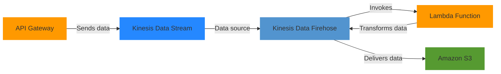

# AWS Key Learning

## Data ingestion

A company needs to configure a real-time data ingestion using an API, process and transforms data as the data is streamed, and a storage solution for the data.

## Bastion host

A bastion host, also known as a jump server or jump box, is a special-purpose computer on a network specifically designed and configured to withstand attacks. It serves as a critical strongpoint to access and administer devices in a separate security zone, typically from an external network. In the context of cloud computing and AWS, a bastion host is often used to securely access EC2 instances or other resources in private subnets of a VPC. Here's a more detailed explanation:

1. Purpose:
   * Provides a single point of entry to a network from an external network, like the internet.
   * Acts as a proxy server for accessing internal resources.
   * Enhances security by limiting direct access to private resources.
2. Characteristics:
   * Usually placed in a public subnet with a public IP address.
   * Highly secured and hardened against attacks.
   * Typically runs minimal services to reduce attack surface.
3. Functionality in AWS:
   * Allows SSH or RDP access to EC2 instances in private subnets.
   * Often the only instance in a VPC that is accessible from the internet via SSH or RDP.
4. Security benefits:
   * Centralizes access control to a single point.
   * Reduces attack surface by limiting direct internet exposure of private instances.
   * Allows for more stringent monitoring and logging of access attempts.
5. Configuration:
   * Usually configured with strict security group rules.
   * Often uses key-based authentication rather than password-based.
   * May implement additional security measures like multi-factor authentication.
6. Best practices:
   * Keep the bastion host updated and patched.
   * Use it only for accessing private resources, not for general-purpose computing.
   * Implement strong access controls and monitoring.
7. Alternatives in AWS:
   * AWS Systems Manager Session Manager can provide similar functionality without the need for a bastion host.
   * AWS VPN solutions can also be used for secure access to private resources.

## Reduce transfer cost betwen S3 and EC2

Deploy an S3 VPC gateway endpoint into the VPC and attach an endpoint policy that allows access to the S3 buckets.\

## RTO and RPO for DynamoDB

Amazon DynamoDB to store customer information. In case of data corruption, a solutions architect needs to design a solution that meets a recovery point objective (RPO) of 15 minutes and a recovery time objective (RTO) of 1 hour.

Configure DynamoDB point-in-time recovery. For RPO recovery, restore to the desired point in time. Most Voted

\

## Handling External certificates

An application needs to be encrypted at the edge with an SSL/TLS certificate that is issued by an external certificate authority (CA). The certificate must be rotated each year before the certificate expires.

Use AWS Certificate Manager (ACM) to import an SSL/TLS certificate. Apply the certificate to the ALB. Use Amazon EventBridge (Amazon CloudWatch Events) to send a notification when the certificate is nearing expiration. Rotate the certificate manually.

## Hybrid Architecture Failover

A solutions architect is designing a new hybrid architecture to extend a company's on-premises infrastructure to AWS. The company requires a highly available connection with consistent low latency to an AWS Region. The company needs to minimize costs and is willing to accept slower traffic if the primary connection fails.

This Option:

* Provides a highly available, low-latency primary connection with Direct Connect
* Offers a cost-effective backup solution with VPN
* Meets the requirement of accepting slower traffic in failover scenarios
* Provides a clear and reliable failover mechanism
* Aligns well with hybrid architecture best practices
