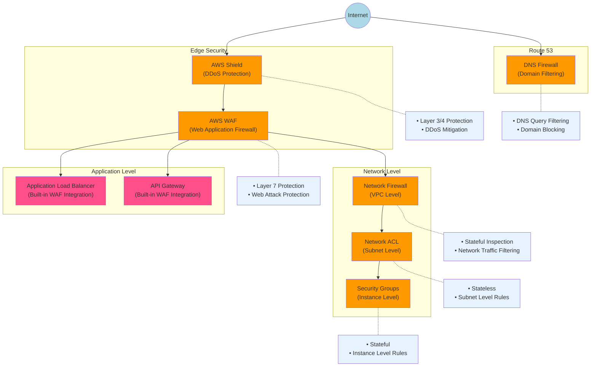

# Security

GuardDuty is like your security guard doing constant patrols. They actively monitor for suspicious activity (like unusual API calls, potential compromised instances, or malicious IP addresses) and alert you when something seems off. The guard doesn't fix issues but watches 24/7 and reports threats.

Detective is like your forensics team that arrives after an incident. When something suspicious happens, Detective helps you investigate by gathering detailed evidence, establishing timelines, and visualizing connections between resources. It's your tool for root cause analysis and understanding the full scope of security issues.

Inspector is like your building inspector who performs scheduled checks. They go through a checklist looking for known vulnerabilities, misconfigurations, and deviations from security best practices in your EC2 instances and container workloads. Think of it as your regular security assessment tool.

Shield is like your building's physical armor and anti-missile defense system. It specifically protects against DDoS attacks:

* Shield Standard (free) is like basic reinforced walls
* Shield Advanced is like a sophisticated missile defense system with a dedicated response team

## AWS Identity Management Types (Most Secure to Least Secure)

1. **IAM Roles with AWS Security Token Service (STS)**
   * Temporary, automatically rotated credentials
   * Least privilege access
   * No long-term credentials to manage
2. **IAM Instance Profiles**
   * Automatically provides and rotates credentials for EC2 instances
   * No need to store credentials on the instance
3. **Web Identity Federation**
   * Uses external identity providers (e.g., Google, Facebook)
   * Temporary credentials, no AWS credentials to manage
4. **AWS Single Sign-On (SSO)**
   * Centralized access management for multiple AWS accounts
   * Integration with existing identity systems
5. **IAM Users with Multi-Factor Authentication (MFA)**
   * Additional layer of security beyond username and password
   * Significantly reduces the risk of unauthorized access
6. **IAM Users with Programmatic Access (Access Keys)**
   * Long-term credentials
   * Requires careful management and regular rotation
7. **IAM Users with Console Access (Username/Password)**
   * Long-term credentials
   * Susceptible to phishing and brute-force attacks if not properly secured
8. **Root Account**
   * Full, unrestricted access to all AWS services and resources
   * Highest risk if compromised, should be used sparingly and secured with MFA

Note: The exact order can be debated and may vary based on specific implementation details and security practices.

## AWS Firewall Services

This diagram shows all AWS firewall services and their typical deployment order from internet-facing to instance level:

1. Edge Security:
   * AWS Shield: DDoS protection
   * AWS WAF: Web Application Firewall for Layer 7 protection
2. Network Level:
   * Network Firewall: VPC-level protection
   * Network ACLs: Subnet-level stateless filtering
   * Security Groups: Instance-level stateful filtering
3. Application Level:
   * ALB with WAF integration
   * API Gateway with WAF integration
4. DNS Level:
   * Route 53 DNS Firewall for domain filtering

Key characteristics for each:

* Shield: Protects against DDoS attacks
* WAF: Protects against web exploits
* Network Firewall: VPC-wide network protection
* NACLs: Stateless, ordered rules
* Security Groups: Stateful, allow-only rules
* DNS Firewall: DNS query filtering

The color coding represents:

* Security services (orange)
* Application services (pink)
* External interface (dark blue)

