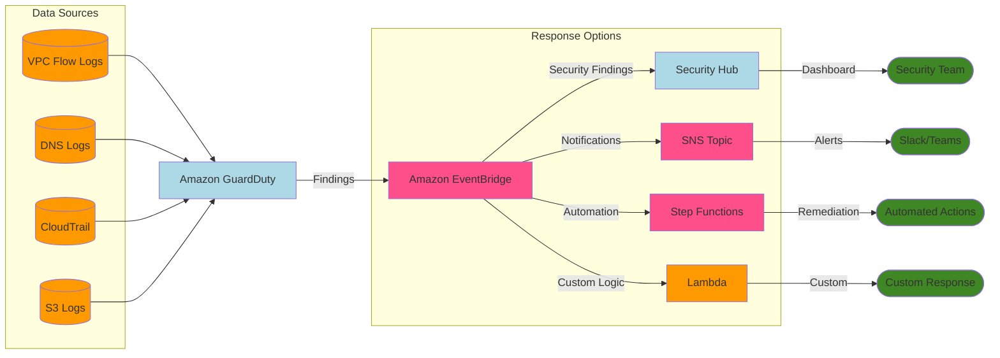

# GuardDuty

Amazon GuardDuty is a threat detection service that uses machine learning to continuously monitor for malicious behavior.

It looks for:

* Unusual API calls, including calls from known malicious IP addresses
* Attempts to disable AWS CloudTrail logging
* Unauthorized deployments
* Compromised instances
* Reconnaissance by would-be attackers
* Port scanning and failed login attempts

Features:

* Alerts appear in the GuardDuty console and Amazon EventBridge
* Receives threat intelligence feeds from third parties like Proofpoint and CrowdStrike, as well as AWS Security, about known malicious domains and IP addresses
* Monitors AWS CloudTrail logs, VPC Flow Logs, and DNS logs
* Supports automated responses using Amazon EventBridge and AWS Lambda
* Uses machine learning and anomaly detection

Threat Detection with AI:

* Takes 7-14 days to establish a baseline of normal behavior on your account
* Findings can be viewed in the GuardDuty console and Amazon EventBridge

## Example of Automated remediation

Yu can use AWS Step Functions for automated remediation of GuardDuty findings. This is a common pattern for security automation. Here's how it typically works:

1. GuardDuty → EventBridge
   * GuardDuty findings are automatically sent to EventBridge
   * You can create rules to filter specific finding types
2. EventBridge → Step Functions
   * EventBridge rules trigger Step Functions workflows
   * The finding details are passed as input to the workflow

Common remediation steps in the Step Function could include:

* Isolating compromised EC2 instances
* Revoking IAM credentials
* Adding IP addresses to Network ACL deny lists
* Creating snapshots for forensics
* Notifying security teams via SNS
* Creating Security Hub findings
* Opening Jira/ServiceNow tickets

\
