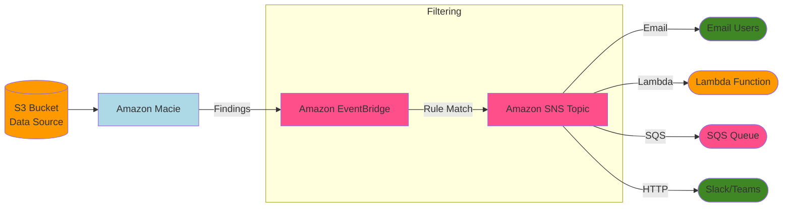

# Macie (S3)

Uses machine learning and pattern recognition to discover sensitive data stored in Amazon S3:

* Uses AI to identify if S3 contains sensitive data, such as PII (Personally Identifiable Information), PHI (Protected Health Information), and financial data.
* Alerts you if you have unencrypted buckets.
* Alerts you about public buckets.
* Can alert about buckets shared with AWS accounts outside of those defined in your AWS Organizations.
* Ideal for compliance frameworks like HIPAA (Health Insurance Portability and Accountability Act) and GDPR (General Data Protection Regulation).
* Can send alerts to Amazon EventBridge and integrates with your event management system.
* Supports automated remediation actions using AWS services, such as AWS Step Functions

