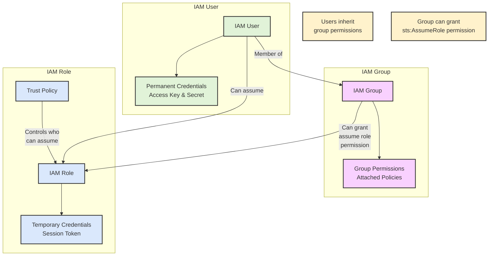
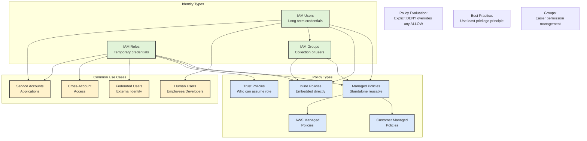

# Identity Management Services

AWS Identity Management services are:

1. AWS IAM (Identity and Access Management):

* The foundational service for managing access to AWS resources
* Creates and manages users, roles, and policies within AWS
* Best for service-to-service authentication and AWS admin access
* All other identity services ultimately translate to IAM roles/policies

2. Amazon Cognito:

* Focused on customer/end-user identity management
* Translates external identities into IAM roles
* Primarily used for web/mobile applications
* Provides two main components:
  * User Pools: Handle user registration, authentication, and profile management
  * Identity Pools: Provide temporary AWS credentials to access AWS services
* Can federate with social and enterprise identity providers

3. AWS Identity Center (formerly AWS SSO):

* Centralizes access management across multiple AWS accounts
* Primarily for enterprise workforce users
* Provides a single sign-on portal for AWS accounts and business applications
* Can integrate with existing identity providers (Active Directory, Okta, etc.)
* Maps enterprise identities to IAM roles across accounts

Key Relationships:

* Both Cognito and AWS Identity Center ultimately use IAM roles for access control
* Cognito is customer-facing while AWS Identity Center is workforce-facing
* **IAM provides the underlying authorization mechanism used by both services**
* They can be used together: e.g., Cognito for customer access to applications, AWS Identity Center for employee access to AWS accounts

