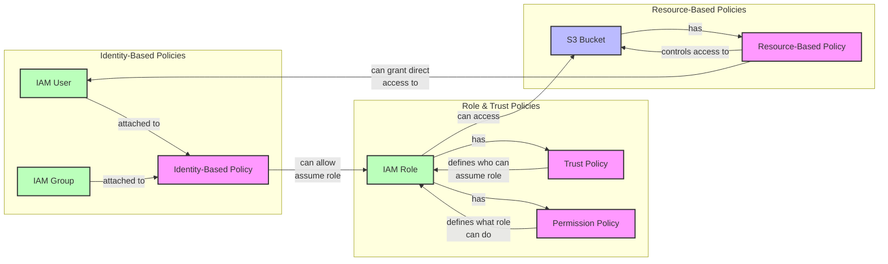

# Identity, Permission, Trust and Resource Policies





There are the following types of policies:&#x20;


### **Identity-based** Policies

* **Identity-based** policies are attached to users/groups and define what those identities can do across AWS services

```json
{
    "Version": "2012-10-17",
    "Statement": [
        {
            "Effect": "Allow",
            "Action": [
                "ec2:StartInstances",
                "ec2:StopInstances"
            ],
            "Resource": "*",
            "Condition": {
                "StringEquals": {
                    "aws:ResourceTag/Environment": "Production"
                }
            }
        },
        {
            "Effect": "Allow",
            "Action": [
                "ec2:DescribeInstances"
            ],
            "Resource": "*"
        }
    ]
}
```

This policy would be attached directly to an IAM user or group and allows them to start/stop EC2 instances tagged as "Production" and view all instances.


### Role Policies

<figure><figcaption></figcaption></figure>

IAM role must have two types of policies:

1. **Trust Policy** (only one):
   1. Defines WHO can assume the role
   2. Sometimes called "trust relationship policy"
   3. Always uses the **sts:AssumeRole** action
   4. Must include Principal element

```json
{
    "Version": "2012-10-17",
    "Statement": [{
        "Effect": "Allow",
        "Principal": {
            "Service": "lambda.amazonaws.com"
        },
        "Action": "sts:AssumeRole"
    }]
}
```

2. **Permission Policies** (can have multiple):
   1. Define WHAT the role can do
   2. Lists allowed/denied AWS actions
   3. No Principal element needed
   4. Can attach multiple permission policies to a role

```json
{
    "Version": "2012-10-17",
    "Statement": [{
        "Effect": "Allow",
        "Action": [
            "s3:GetObject",
            "s3:PutObject"
        ],
        "Resource": "arn:aws:s3:::my-bucket/*"
    }]
}
```

Think of it this way:

* Trust Policy = Who can use this role?
* Permission Policy = What can this role do?

Both are required for a role to be functional. You can't have a role without a trust policy, and a role without permission policies wouldn't be able to do anything.

### **Resource-based**

**Resource-based** (e.g. S3 bucket policy) policies are attached to resources (like S3 buckets) . Resource-based policy must declare the "Principle" element to define who can access that resource.

```json
{
    "Version": "2012-10-17",
    "Statement": [
        {
            "Sid": "AllowCrossAccountAccess",
            "Effect": "Allow",
            "Principal": {
                "AWS": "arn:aws:iam::123456789012:role/CrossAccountRole"
            },
            "Action": [
                "s3:GetObject",
                "s3:PutObject"
            ],
            "Resource": "arn:aws:s3:::my-bucket/*"
        }
    ]
}
```

This policy is attached directly to the S3 bucket and controls access to that specific resource.


### Example

A common real-world example might combine these:

1. A developer has an identity-based policy allowing them to assume certain roles
2. Those roles have permission policies defining what AWS services they can access
3. The resources they need to access might have resource-based policies allowing access from those roles
