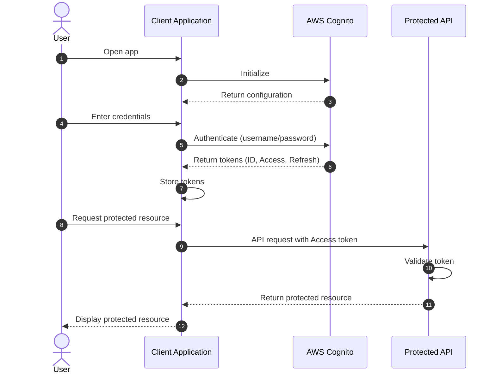

# Cognito

Cognito provides authentication, authorization, and user management for your web and mobile apps in a single service without the need for custom code. Your users can sign in directly with a username and password they create on through a third party (e.g. Facebook, Amazon, Google or Apple)


Features:

1. Sign-up and sign-in options for your apps
2. Access for guest users
3. Acts as an identity broker between your application and web ID providers.


The two components of Cognito are:&#x20;

* User pools: are directories of users that provide sign-up and sign-in options for your application
* Identity pools: allow you to give your user access to other AWS services.&#x20;

User pools and Itentity pools can be used either separatly or together.&#x20;

```mmd
sequenceDiagram
    autonumber
    actor User
    participant App as Client Application
    participant Cognito as AWS Cognito
    participant API as Protected API

    User->>App: Open app
    App->>Cognito: Initialize
    Cognito-->>App: Return configuration

    User->>App: Enter credentials
    App->>Cognito: Authenticate (username/password)
    Cognito-->>App: Return tokens (ID, Access, Refresh)

    App->>App: Store tokens

    User->>App: Request protected resource
    App->>API: API request with Access token
    API->>API: Validate token
    API-->>App: Return protected resource

    App-->>User: Display protected resource
```




