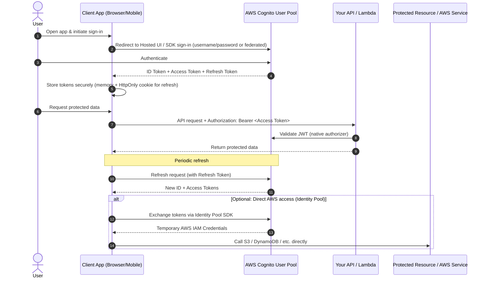

# Amazon Cognito – Complete Guide (February 2026)

**Amazon Cognito** is a fully managed AWS service that handles **authentication**, **authorization**, and **user management** for web, mobile, and serverless applications — without requiring you to build or maintain custom user directories, password hashing, token logic, or session management.

Users can sign in directly with credentials they create in your app (username/password), or federate through third-party identity providers (IdPs) such as:

- Google
- Facebook
- Login with Amazon
- Sign in with Apple
- SAML 2.0 providers (e.g., Microsoft Entra ID / Active Directory)
- OpenID Connect (OIDC) providers

Cognito supports secure sign-up, sign-in, MFA (SMS/email/TOTP), password policies, custom attributes, user groups, token issuance, and session revocation — all with built-in security and compliance features.

## Core Components

Cognito has **two main services** that solve complementary problems:

| Component          | Purpose                                      | Key Outputs                              | Typical Use Cases                                      | Can Be Used Alone? |
|--------------------|----------------------------------------------|------------------------------------------|--------------------------------------------------------|--------------------|
| **User Pools**     | **Authentication** + user directory          | ID Token, Access Token, Refresh Token (JWTs) | User sign-up/sign-in, federated login, API protection | Yes                |
| **Identity Pools** | **Authorization** — temporary AWS credentials | Temporary IAM credentials (access key, secret key, session token) | Direct client access to S3, DynamoDB, Lambda, etc.     | Yes (but usually paired) |

- **User Pools** act as your user directory and identity provider (IdP), issuing JSON Web Tokens (JWTs) after successful authentication.
- **Identity Pools** (formerly Federated Identities) map authenticated (or guest) users to temporary AWS IAM credentials for fine-grained access to AWS resources.
- **Best practice (2026)**: Use **User Pools** for login + API auth. Add **Identity Pools** only when clients need direct AWS service access (e.g., browser uploads to S3).

User Pools and Identity Pools can be used **separately** or **together** — the most common modern pattern is **User Pools → Identity Pools** for authenticated flows.

## Cognito Tokens – The Three Types

After successful authentication in a **User Pool**, Cognito issues three JWTs (or opaque tokens):

1. **ID Token**  
   - **Purpose**: Proves **who** the user is (authentication / OpenID Connect identity).  
   - **Contains**: User claims (sub/user ID, email, name, phone, custom attributes, groups).  
   - **Best used for**: Frontend UI (display name/email), identity-based decisions in your app.  
   - **Not** primarily for API authorization (contains sensitive PII — avoid sending unnecessarily).  
   - Lifetime: Default 1 hour (configurable).

2. **Access Token**  
   - **Purpose**: Authorizes actions/scopes the user can perform (OAuth 2.0 authorization).  
   - **Contains**: Scopes (e.g., `openid`, `profile`, custom scopes), groups, client_id.  
   - **Best used for**: Calling your APIs (via API Gateway JWT authorizer), user self-service operations (e.g., UpdateUserAttributes — requires `aws.cognito.signin.user.admin` scope).  
   - **2026 best practice**: Preferred token for backend API authorization to follow least-privilege and separation of concerns.

3. **Refresh Token**  
   - **Purpose**: Obtain new ID + Access tokens without re-login.  
   - **Opaque/encrypted** — readable only by Cognito.  
   - Lifetime: Default 30 days (configurable up to 10 years).  
   - **Security**: Store securely (HttpOnly cookie or secure storage), never expose client-side. Revoke on logout.

**Token best practices (2026)**:
- Use **Access Token** for API calls when possible (scopes + least privilege).
- Use **ID Token** safely with Cognito's native API Gateway authorizer (AWS verifies it securely).
- Never store tokens in localStorage (XSS risk) — use secure cookies or Amplify Auth helpers.
- Enable **token revocation** to invalidate tokens on logout, compromise, or account disable.

### Sample Token Payloads

**ID Token** (decoded JWT payload):

```json
{
  "sub": "a1b2c3d4-5678-90ab-cdef-EXAMPLE11111",
  "iss": "https://cognito-idp.eu-west-1.amazonaws.com/eu-west-1_EXAMPLE",
  "aud": "3q1example4client8id0abc",
  "token_use": "id",
  "auth_time": 1708300800,
  "exp": 1708304400,
  "iat": 1708300800,
  "email": "jane.doe@example.com",
  "email_verified": true,
  "name": "Jane Doe",
  "phone_number": "+44712345678",
  "cognito:username": "jane.doe",
  "cognito:groups": ["admin", "developers"],
  "custom:department": "Engineering",
  "custom:tenant_id": "tenant-42"
}
```

> Contains **user identity claims** (PII). Use for displaying user info in the UI or passing identity to Identity Pools. `token_use` is always `"id"`.

**Access Token** (decoded JWT payload):

```json
{
  "sub": "a1b2c3d4-5678-90ab-cdef-EXAMPLE11111",
  "iss": "https://cognito-idp.eu-west-1.amazonaws.com/eu-west-1_EXAMPLE",
  "client_id": "3q1example4client8id0abc",
  "token_use": "access",
  "scope": "openid profile aws.cognito.signin.user.admin custom-api/read:orders custom-api/write:orders",
  "auth_time": 1708300800,
  "exp": 1708304400,
  "iat": 1708300800,
  "jti": "EXAMPLE-jwt-id-12345",
  "username": "jane.doe",
  "cognito:groups": ["admin", "developers"],
  "origin_jti": "EXAMPLE-origin-jwt-id-67890",
  "event_id": "abcdef12-3456-7890-abcd-ef1234567890",
  "version": 2
}
```

> Contains **scopes and groups** but **no PII** (no email, name, or phone). Use for API authorization. `token_use` is always `"access"`. Note: `client_id` replaces `aud`.

**Refresh Token**:

```
eyJjdHkiOiJKV1QiLCJlbmMiOiJBMjU2R0NNIiwiYWxnIjoiUlNBLU9BRVAifQ...
(opaque encrypted blob — not a standard JWT)
```

> The Refresh Token is **encrypted and opaque** — it cannot be decoded or inspected. Only Cognito can read it. It contains no user-readable claims. Your application stores it securely and sends it back to Cognito to obtain new ID and Access Tokens.

**Key differences at a glance:**

| Field | ID Token | Access Token | Refresh Token |
|---|---|---|---|
| `token_use` | `"id"` | `"access"` | N/A (opaque) |
| User PII (email, name, phone) | Yes | **No** | N/A |
| `cognito:groups` | Yes | Yes | N/A |
| `scope` | No | Yes | N/A |
| Audience field | `aud` (client ID) | `client_id` | N/A |
| Custom attributes | Yes (`custom:*`) | No | N/A |
| Decodable | Yes (JWT) | Yes (JWT) | **No** (encrypted) |
| Default lifetime | 1 hour | 1 hour | 30 days |

## Typical Authentication Flow



## Cognito User Pool Authorizer (API Gateway)

A **Cognito User Pool Authorizer** is a built-in API Gateway feature that validates Cognito-issued JWTs **before** your backend code runs. It offloads authentication entirely to the API Gateway layer, so your Lambda or backend never receives unauthenticated requests.

### How It Works

```
Client → API Gateway → [Cognito User Pool Authorizer] → Lambda / Backend
                              ↓
                     Validates JWT signature,
                     expiration, issuer, audience
                     → 401 if invalid
```

1. The client sends a request with `Authorization: Bearer <token>` (ID Token or Access Token).
2. API Gateway passes the token to the Cognito User Pool Authorizer.
3. The authorizer validates the token against the configured User Pool (checks signature, expiration, issuer `iss`, and audience `aud`/`client_id`).
4. If valid, the request proceeds to the backend with the decoded claims available in `event.requestContext.authorizer.claims` (REST API) or `event.requestContext.authorizer.jwt.claims` (HTTP API).
5. If invalid or expired, API Gateway returns `401 Unauthorized` immediately — your backend is never invoked.

### When to Use

| Scenario | Use Cognito User Pool Authorizer? |
|---|---|
| Protect APIs behind Cognito sign-in | **Yes** — this is the primary use case |
| Simple group-based access (e.g., admins vs users) | **Yes** — check `cognito:groups` claim in Lambda |
| OAuth2 scope-based authorization (e.g., `read:orders`) | **Yes** — use Access Token with custom scopes |
| Public + authenticated mixed endpoints | **Yes** — set authorizer per route/method |
| Fine-grained per-resource authorization (e.g., user can only edit own records) | **Partially** — authorizer handles authentication, your backend handles resource-level authorization using claims |
| Non-Cognito identity providers only | **No** — use a Lambda authorizer or JWT authorizer with your IdP |
| Machine-to-machine (M2M) with client credentials | **Yes** — use Cognito client credentials grant + Access Token with custom scopes |

### When NOT to Use

- **Custom token validation logic** — If you need to check tokens against a database, call external services, or apply business rules during auth, use a **Lambda Authorizer** instead.
- **Non-JWT authentication** — API keys, basic auth, or custom headers require a Lambda Authorizer.
- **Third-party IdP without Cognito** — If you use Auth0, Okta, or another IdP directly (not federated through Cognito), use the **JWT Authorizer** (HTTP API) or a Lambda Authorizer (REST API).

### Setup: REST API (API Gateway v1)

1. **Create the Authorizer** in API Gateway Console:
   - Go to your REST API → **Authorizers** → **Create New Authorizer**
   - Type: **Cognito**
   - Cognito User Pool: select your pool
   - Token Source: `Authorization` (the header name)

2. **Attach to Methods**:
   - Go to **Resources** → select a method (e.g., `GET /orders`)
   - **Method Request** → Authorization → select your Cognito authorizer

3. **Deploy** the API to a stage.

**CloudFormation / SAM example (REST API):**

```yaml
Resources:
  MyApi:
    Type: AWS::Serverless::Api
    Properties:
      StageName: prod
      Auth:
        DefaultAuthorizer: MyCognitoAuthorizer
        Authorizers:
          MyCognitoAuthorizer:
            UserPoolArn: !GetAtt MyUserPool.Arn

  GetOrdersFunction:
    Type: AWS::Serverless::Function
    Properties:
      Handler: orders.handler
      Runtime: nodejs20.x
      Events:
        GetOrders:
          Type: Api
          Properties:
            RestApiId: !Ref MyApi
            Path: /orders
            Method: GET
            # Inherits MyCognitoAuthorizer from API default
```

### Setup: HTTP API (API Gateway v2)

HTTP APIs use a **JWT Authorizer** that works natively with Cognito User Pools:

```yaml
Resources:
  MyHttpApi:
    Type: AWS::ApiGatewayV2::Api
    Properties:
      Name: my-http-api
      ProtocolType: HTTP

  CognitoAuthorizer:
    Type: AWS::ApiGatewayV2::Authorizer
    Properties:
      ApiId: !Ref MyHttpApi
      AuthorizerType: JWT
      Name: CognitoJWTAuthorizer
      IdentitySource: "$request.header.Authorization"
      JwtConfiguration:
        Audience:
          - !Ref MyUserPoolClient
        Issuer: !Sub "https://cognito-idp.${AWS::Region}.amazonaws.com/${MyUserPool}"
```

### Accessing Claims in Lambda

Once the authorizer validates the token, your Lambda receives the decoded claims:

```javascript
// REST API (v1) — claims are strings
exports.handler = async (event) => {
  const claims = event.requestContext.authorizer.claims;
  const userId = claims.sub;
  const email = claims.email;
  const groups = claims['cognito:groups']; // comma-separated string

  // Use claims for resource-level authorization
  const orders = await getOrdersByUser(userId);
  return { statusCode: 200, body: JSON.stringify(orders) };
};
```

```javascript
// HTTP API (v2) — claims are in jwt.claims
exports.handler = async (event) => {
  const claims = event.requestContext.authorizer.jwt.claims;
  const userId = claims.sub;
  const scopes = event.requestContext.authorizer.jwt.scopes;

  return { statusCode: 200, body: JSON.stringify({ userId, scopes }) };
};
```

### ID Token vs Access Token — Which to Send?

| Aspect | ID Token | Access Token |
|---|---|---|
| **Contains** | User identity claims (email, name, sub, groups) | Scopes, groups, client_id |
| **REST API Cognito Authorizer** | Supported (validates `aud` = client ID) | Supported (validates `client_id`) |
| **HTTP API JWT Authorizer** | Supported | **Preferred** — supports scope-based authorization |
| **Scope enforcement** | Not applicable | Authorizer can require specific scopes per route |
| **Best practice** | Use when backend needs identity claims | Use for API authorization (least privilege) |

**Recommendation**: Send the **Access Token** for API calls. If your backend needs user attributes (email, name), either:
- Include them as custom claims via a Pre Token Generation Lambda Trigger, or
- Look up the user by `sub` from the Access Token.

### Common Pattern: Group-Based Authorization

```javascript
exports.handler = async (event) => {
  const claims = event.requestContext.authorizer.claims;
  const groups = (claims['cognito:groups'] || '').split(',');

  if (!groups.includes('admin')) {
    return { statusCode: 403, body: JSON.stringify({ message: 'Forbidden' }) };
  }

  // Admin-only logic here
};
```

### Cognito User Pool Authorizer vs Lambda Authorizer vs IAM Authorization

| Feature | Cognito User Pool Authorizer | Lambda Authorizer | IAM Authorization |
|---|---|---|---|
| **Auth mechanism** | Cognito JWT validation | Custom code (any token/header) | AWS Sig v4 signed requests |
| **Setup complexity** | Low (configuration only) | Medium (write + deploy Lambda) | Low (IAM policies) |
| **Latency** | Low (built-in validation) | Higher (Lambda cold start possible) | Low |
| **Caching** | Built-in (configurable TTL) | Optional (configurable TTL) | N/A |
| **Cost** | No extra cost | Lambda invocation cost | No extra cost |
| **Custom logic** | No (validation only) | Yes (database lookups, business rules) | No |
| **Best for** | Cognito-based apps | Custom IdPs, complex auth rules | AWS service-to-service, SDK clients |