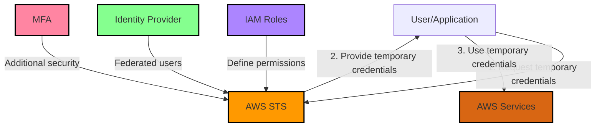

# STS

AWS Security Token Service (STS) is a web service that enables you to request temporary, limited-privilege credentials for AWS Identity and Access Management (IAM) users or for users that you authenticate (federated users).

STS integrates with pther AWS Services:&#x20;

1. IAM: Works closely with IAM for role definitions and permissions.&#x20;
2. Cognito: Can use STS for providing temporary credentials to mobile or web app users.&#x20;
3. AWS Organizations: Can be used in conjunction with STS for cross-account access.

1. Key Features:&#x20;
   1. Temporary Credentials: STS issues short-term security credentials that are valid for a specified duration.&#x20;
   2. Limited Privileges: These credentials can have restricted permissions compared to the original IAM user.
   3. No Long-term Secrets: Since credentials are temporary, there's no need to rotate or revoke long-term security credentials.
2. Use Cases:&#x20;
   1. Federation: Integrate with external identity providers (e.g., Active Directory, Facebook).&#x20;
   2. Cross-Account Access: Allow users from one AWS account to access resources in another.
   3. Enhanced Security: Implement the principle of least privilege by providing temporary, limited-scope credentials.
3. Core API Calls:
   1. **AssumeRole**: Obtain temporary credentials for cross-account access or enhanced security.&#x20;
   2. **AssumeRoleWithWebIdentity**: Used for web identity federation (e.g., login with Google, Facebook).
   3. **AssumeRoleWithSAML**: Used for SAML-based federation (e.g., Active Directory).
   4. **GetSessionToken**: Obtain temporary credentials for an IAM user or AWS account root user.
4. Components:&#x20;
   1. **IAM Roles:** Define the permissions that STS will use to generate temporary credentials.&#x20;
   2. **Trust Relationships:** Specify who can assume a role (e.g., IAM users, external accounts, services).&#x20;
   3. **Temporary Security Credentials:** Consist of an access key ID, a secret access key, and a security token.
5. Security Best Practices:&#x20;
   1. Use STS instead of creating IAM users with long-term credentials.&#x20;
   2. Implement the principle of least privilege when defining permissions for roles.&#x20;
   3. Set appropriate expiration periods for temporary credentials.

