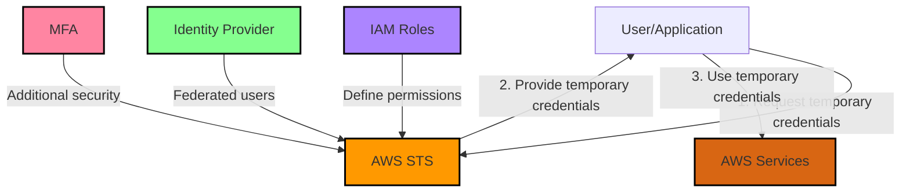

# STS

AWS Security Token Service (STS) Explained:

1. Definition: AWS STS is a web service that enables you to request temporary, limited-privilege credentials for AWS Identity and Access Management (IAM) users or for users that you authenticate (federated users).
2. Key Features: a) Temporary Credentials: STS issues short-term security credentials that are valid for a specified duration. b) Limited Privileges: These credentials can have restricted permissions compared to the original IAM user. c) No Long-term Secrets: Since credentials are temporary, there's no need to rotate or revoke long-term security credentials.
3. Use Cases: a) Federation: Integrate with external identity providers (e.g., Active Directory, Facebook). b) Cross-Account Access: Allow users from one AWS account to access resources in another. c) Enhanced Security: Implement the principle of least privilege by providing temporary, limited-scope credentials.
4. Core API Calls (important for the exam): a) AssumeRole: Obtain temporary credentials for cross-account access or enhanced security. b) AssumeRoleWithWebIdentity: Used for web identity federation (e.g., login with Google, Facebook). c) AssumeRoleWithSAML: Used for SAML-based federation (e.g., Active Directory). d) GetSessionToken: Obtain temporary credentials for an IAM user or AWS account root user.
5. Components: a) IAM Roles: Define the permissions that STS will use to generate temporary credentials. b) Trust Relationships: Specify who can assume a role (e.g., IAM users, external accounts, services). c) Temporary Security Credentials: Consist of an access key ID, a secret access key, and a security token.
6. Security Best Practices: a) Use STS instead of creating IAM users with long-term credentials. b) Implement the principle of least privilege when defining permissions for roles. c) Set appropriate expiration periods for temporary credentials.
7. Integration with Other AWS Services: a) IAM: Works closely with IAM for role definitions and permissions. b) Cognito: Can use STS for providing temporary credentials to mobile or web app users. c) AWS Organizations: Can be used in conjunction with STS for cross-account access.
8. Exam Tips:
   * Understand the difference between AssumeRole, AssumeRoleWithWebIdentity, and AssumeRoleWithSAML.
   * Know how to set up cross-account access using STS.
   * Be familiar with the concept of identity federation and how STS facilitates it.
   * Understand the security benefits of using temporary credentials over long-term access keys.

For the AWS Certified Solutions Architect - Associate exam, you should be comfortable with these concepts and be able to apply them in scenario-based questions. The exam may present situations where you need to choose the most appropriate and secure way to grant access to AWS resources, and understanding STS will be crucial for these types of questions.

