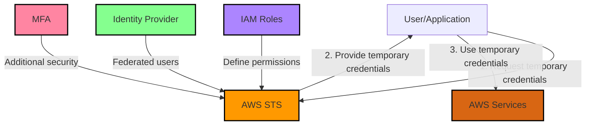

# STS



```mermaid
graph TD
    A[User/Application] -->|1. Request temporary credentials| B[AWS STS]
    B -->|2. Provide temporary credentials| A
    A -->|3. Use temporary credentials| C[AWS Services]
    D[IAM Roles] -->|Define permissions| B
    E[Identity Provider] -->|Federated users| B
    F[MFA] -->|Additional security| B
    
    style B fill:#ff9900,stroke:#000000,stroke-width:2px
    style C fill:#d86613,stroke:#000000,stroke-width:2px
    style D fill:#ac85ff,stroke:#000000,stroke-width:2px
    style E fill:#85ff8f,stroke:#000000,stroke-width:2px
    style F fill:#ff85a2,stroke:#000000,stroke-width:2px
```

```mermaid
```
